Session 4: Introduction to Git and GitHub
================================================================

##Part 1: Your first repository
Start up your GitHub client you downloaded in part 0.
###Create a new local repository
To create a new local repository, click the "+" icon in the top left corner of the program.

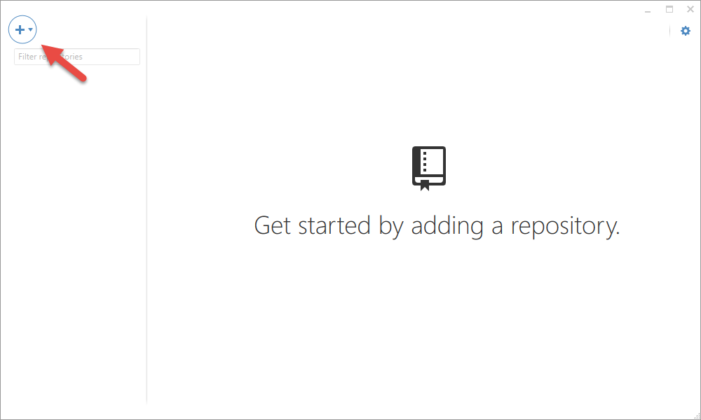

Here you'll be given the option to create or clone a new repo, set the name, path, and default git ignore.

It doesn't matter what you name it, remember where you save it though! As for the Git ignore, the default "Windows" setting will be good enough for now. We'll talk more about Git ignore [later](#ignore).

Hit the checkbox when you're ready. Congrats, you just created your first repository!

###Overview
Here is a basic overview/reference of the GitHub client.

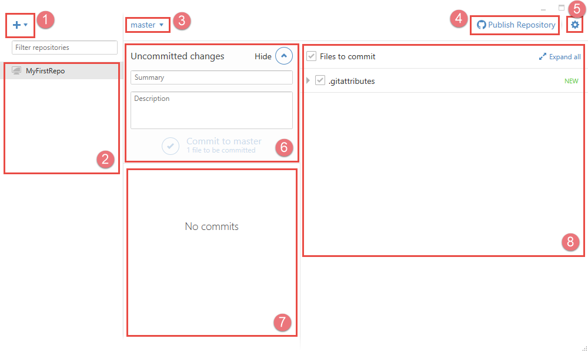

1. Create or clone a new repository
2. Currently open repositories
3. Current branch
4. Publish/Sync repository to GitHub.
5. Settings
6. Commit message/submit for latest changes
7. Past commits for current branch
8. Latest changes

###Your first commit

Go to the folder you just created your repository in. You can get there easily by clicking on the settings gear in the upper right corner and clicking "Open in Explorer"

You should now be in your new, empty repository. You'll notice some files have been automatically created. Specfically, a .git folder and a .gitattributes file. 

The .git folder has all the information and settings for your repository, you should never mess with this folder unless you know exactly what you're doing

The .gitattributes file was automatically created for us by GitHub when we choice "Windows" as our settings. It tells Git how to handle certain files. For now, we can ignore it.

Let's try adding something to your new repository. Right click and hit New->Text Document to create a .txt file.

Now rename this file to `README.md`

Why `README.md`? .md is a "Markdown" type format. It's a simple way of formatting text. A file called "`README.md`" will later automatically be shown on your GitHub project page.

You can then open up `README.md` in your text editor of choice. Notepad will work nicely for our purposes.

In classic programmer fashion, let's write the famous first output:

> Hello World!

Save the file, close your text editor, and open your GitHub client back up.

On the right, you should see our new README.md file. If you like, you can hit the little arrow and see the contents of the file that have changed. So far it's just our "Hello world!" line.

Now we're going to commit our first changes. Be sure to write a descriptive commit message! You will thank yourself later as you're trying to figure out what you did during each commit in the future, so it's good to get in the habbit now. I wrote:

Summary: 
>First Commit

Description:
> Added readme file and .gitattributes

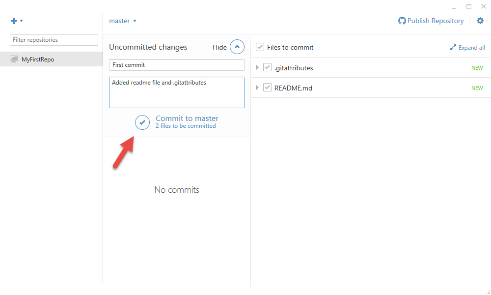

Hit the checkmark to make your first commit. You should see the commit appear in your history. Your changes have been saved!

###Change something!
Now let's get to the part to show why Git is useful. Go back to your folder (Settings->Open in Explorer) and open back up your `README.md` file.

Add a new line:

> Hello World!
> 
> This is my first time using Git!

Save the file and close your text editor again. Now switch back to your GitHub Client. You'll see that it noticed right away the has been changed.

It doesn't just track if the file has been modified, but also exactly how it's been changed. If you click the arrow to expand, you'll see it shows that line 1 did not change, but line 2 and 3 did.

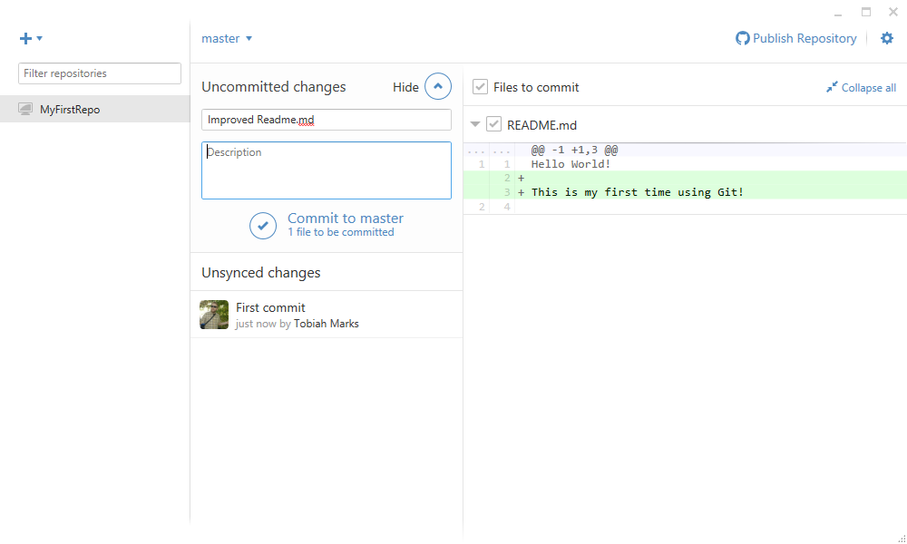

Write a new commit message and submit. You now have a saved the changes to your `README.md` file.

###Breaking up changes into multiple commits

What if you changed a lot of different things, but didn't necessarily want to save all those changes at once?

Let's create three new files. `NewFile1.txt`, `NewFile2.txt`, and `NewFile3.txt`. Doesn't matter the contents.

If you go back to your GitHub client, you'll notice checkboxes next to each of the names of the new or changed files. To not include a change, simply uncheck the box.

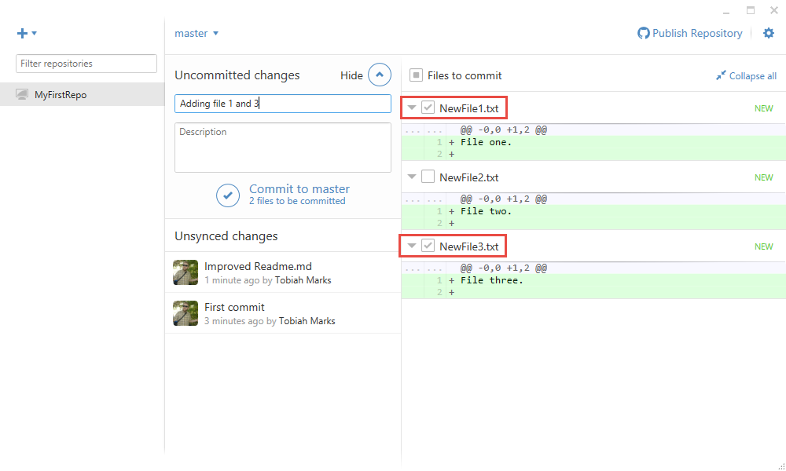

Let's say we still have more work to do on `NewFile2.txt` before we want to commit to the changes, but we want to save our work in `NewFile1.txt` and `NewFile3.txt`.

Make sure the checkboxes next to `NewFile1.txt` and `NewFile3.txt` and checked, and uncheck the one next to `NewFile2.txt`. Then commit!

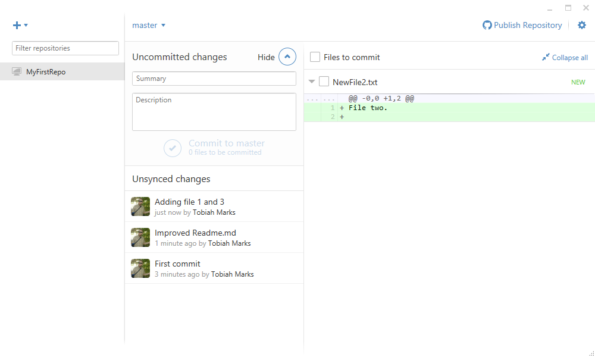

Don't worry, changes to `NewFile2.txt` aren't lost. Your folder is still just how it was before, but the changes to `NewFile1.txt` and `NewFile3.txt` are now saved. You can then commit `NewFile2.txt` in a later update.

###Discard changes

What if you are working on your program, and you mess something up. How do you undo your latest changes? Maybe you were working on that `NewFile2.txt` and decided that it wasn't a great feature afterall.

Simply right click the file, and hit "Discard Changes"

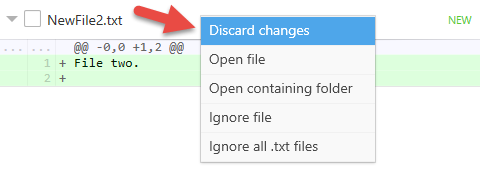

----------
**WARNING** - There is no recovery for unsaved changes. Make sure you really want to discard all the changes since the last version!

----------

Since `NewFile2.txt` was a new file, discarding the changes deletes it from your project folder.

###Renaming and deleting files

Git automatically monitors all changes to files being tracked.

For example, let's try changing `NewFile3.txt` to `NewFile2.txt`, now that the original `NewFile2.txt` file was deleted in the last step.

After doing so, your GitHub client should look like this:

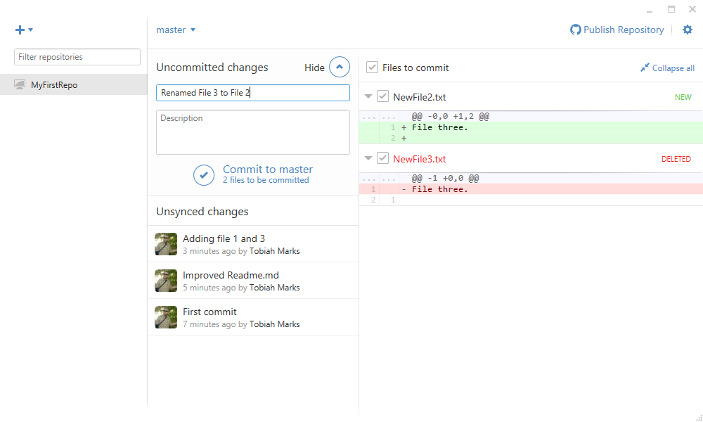

If you delete a file, a "delete" change will appear in the commit changes panel. However, if you rename, sometimes it thinks that one file has been deleted and a new one added.

If you want, you can rename files through the Git shell instead, but in most cases it's probably just as easy to track the rename two changes.

###Reverting changes

What if you wanted to undo a change after you've already committed?

Simple! In your GitHub client, go to the commit in question you would like to revert back. For example, let's undo that first change we made to our `README.md` file.

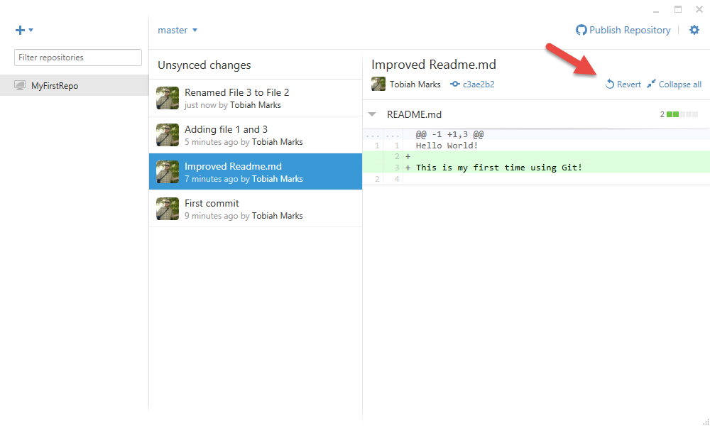

Clicking the "Revert" button will undo all the changes done in this commit.

In the GitHub client, this will create a new commit that undoes those changes.

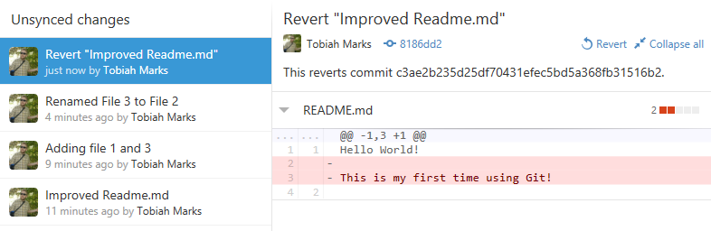

GitHub's client automatically fills out the message message for the reverse change. Now if you go back to your folder, you'll see that `README.md` only has one line!

----------
**NOTE:** You may need to close and reopen the file in your text editor in order to see the changes.

----------

###Ignoring files

What if you had files that you didn't want to track?

Let's say our compiler generates a `Build.log` file. We don't need to track the state of this, or any .log file within our project.

When you right click the file, you are given a couple options:

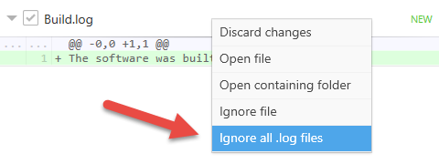

If you just want to ignore this specific file for whatever reason, you can click the "Ignore file" option and do so.

If you want to ignore ALL files with the extension .log (or whatever type the currently selected file happens to be), click the second option.

----------
**NOTE:** Files already tracked/committed will still be tracked. But all future files with that extension will no longer appear in the GitHub client.

----------

This will automatically generate a `.gitignore` file if you do not have one already.

A `.gitignore` file lists all the files and extension types Git should ignore when looking for changes.

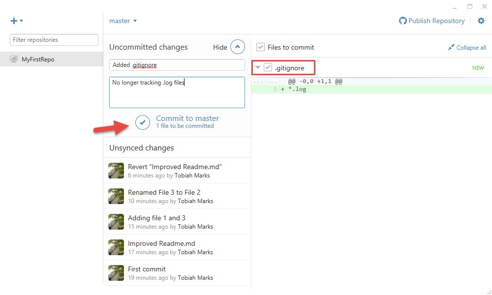

Remember to commit your new `.gitignore` file to make sure others who download your project will also have .log extensions ignored!

If you would like to add a premade `.gitignore` file designed for whatever kind of project you are working on, GitHub provides a repository of commonly used project types.

Visit <https://github.com/github/gitignore> to see the full list. Download or copy/paste the option you want into your own project file. Remember, you may need to change the file name needs to be "`.gitignore`" in order to work.

##End of Part 1

[Click here](../README.md "Open main readme") to return to the main workshop readme, or [click here](../Part2/README.md "Open Part 2") to skip directly to Part 2.