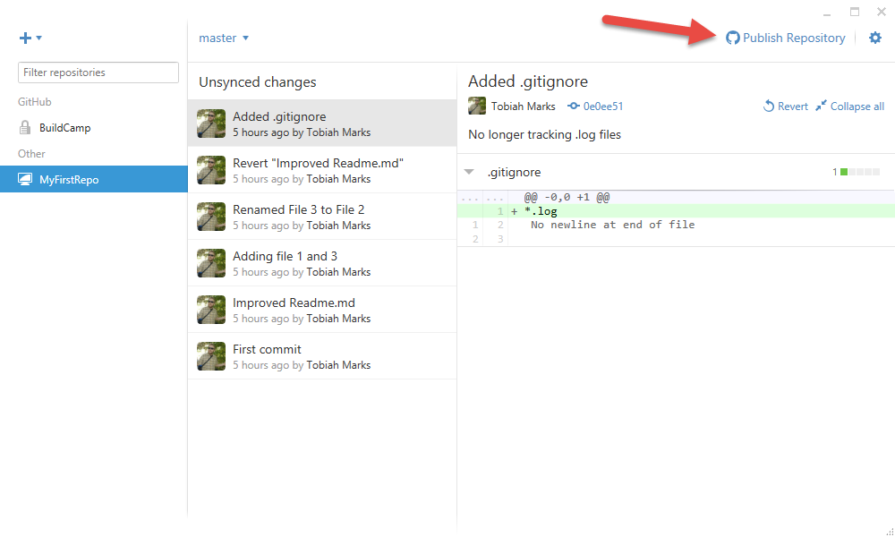
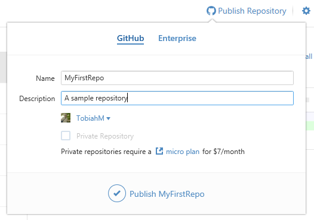
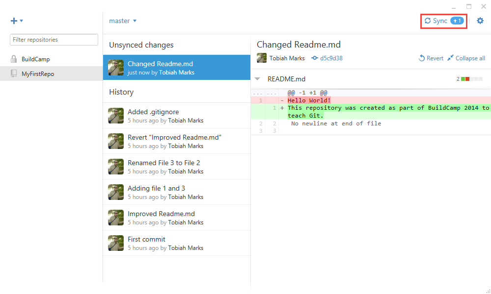
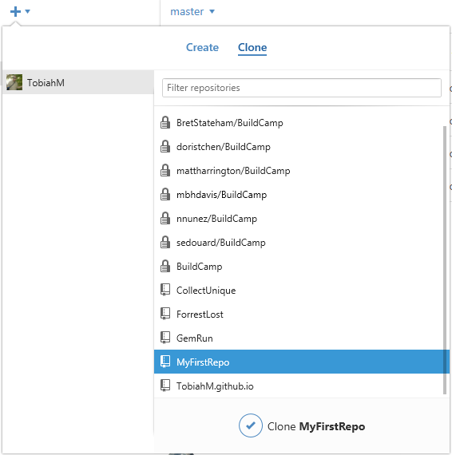
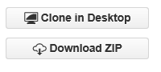
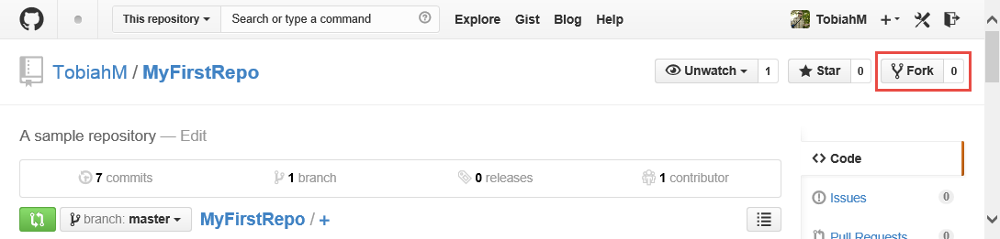

Session 4: Introduction to Git and GitHub
================================================================

##Part 2: Publishing, cloning, and forking.
Time to put your project online!
###Publish a new repository
GitHub makes it easy to share your code with others online!

To publish your local repository, click the "Publish Repository" button in the upper right hand corner.

GitHub will give you some choices. If you want to release your source code for everyone to see, it's free.

Click publish and in a moment your code will be online!

Once your project is linked to an online repository, the publish button will change to a "Sync" button.

If you want to make sure you have the latest code from the web, click the button to see if you need to download any changes.

###Push changes

After you've made a new commit, the Sync button will show that your local repository is head of the current online one.

To "Push" these changes to the server, just click the sync button!

Now you can access the latest code for your projects from any computer with an internet connection.
###Clone an existing repository

To download an existing repository to your computer, you have to "Clone" it.

GitHub's client makes it easy to clone any repository tied to your GitHub account. Click the new repository button, and hit the "Clone" tab.

Here you'll see a list of all the repositories currently tied to my GitHub account. Highlight is the MyFirstRepo repository I just uploaded.

You can access other repositories by going to [GitHub.com](http://www.GitHub.com "GitHub"). On the side of every public project you'll see these two buttons:

If you just want to download the files, you can get the zip. But if you would like to access it using git to be able to look at past commits, and commit your own changes, click the "Clone in Desktop" button and GitHub will automatically request to open your GitHub client.

Choice a location to save the files in, and now you have your own copy of that repository on your local machine!

###Fork an existing repository

"Forking" is similar to cloning, but GitHub automatically links your new cloned repository to your account and to the original repository from which it came from.

Using your web browser on [GitHub](http://www.GitHub.com "GitHub")'s website, there is a "Fork" button on the top right of project pages.

Forking a project adds a new repo to your account, which you can clone in GitHub's client. You can make whatever changes you would like to your version of the repository, and it won't effect the original.

Why would you want to do this? Because later on, you can make a pull request to merge those changes back in.

###Pull requests

Let's say you want to work on an open source project. You decide to add a new feature to make the project even better.

You could clone it and work on your own new repo, which you may or may not share with others. Instead, you should work on a fork of the original project.

Then when you've finished making your changes and want to push them back into the original project for others to use, you can make a new "Pull" request. GitHub has a system for this built right into the website.

You can add documentation of exactly what you added and why, and the repository owner can review all the changes before making them officially part of the original repository.

That's how you can contribute to the projects of others, and one of the basis of how open sourced software is built!

##End of Part 2

[Click here](../README.md "Open main readme") to return to the main workshop readme, or [click here](../Part3/README.md "Open Part 3") to skip directly to Part 3.