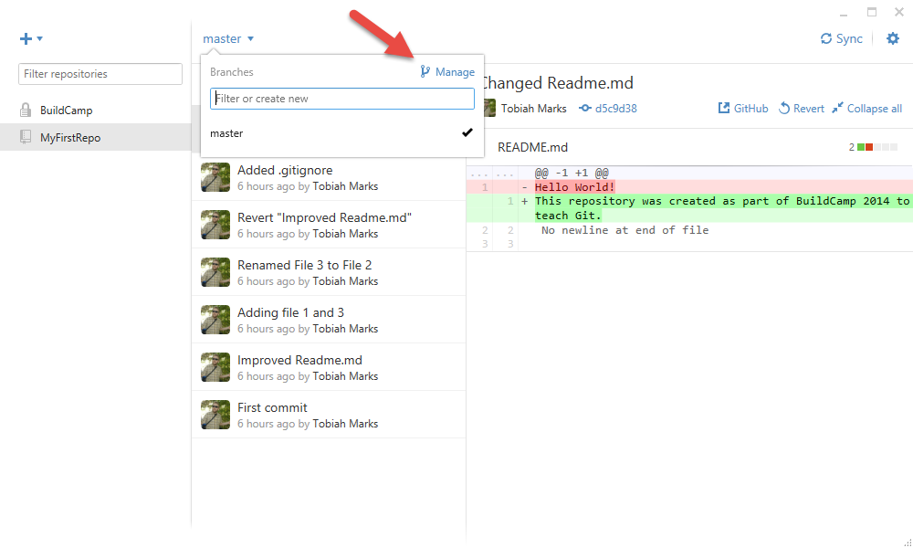
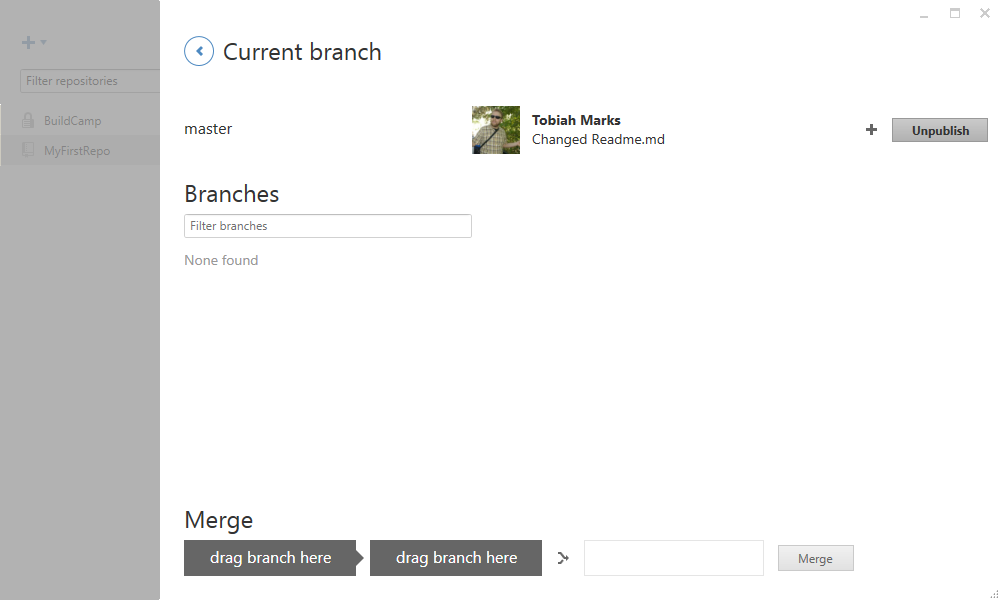
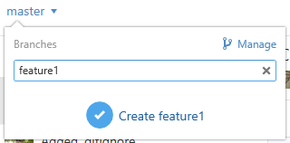
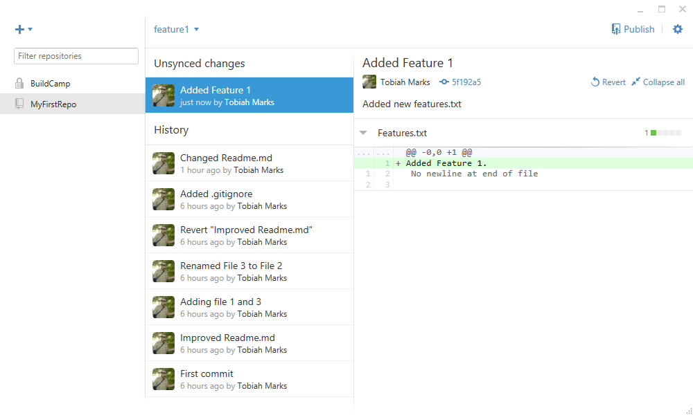
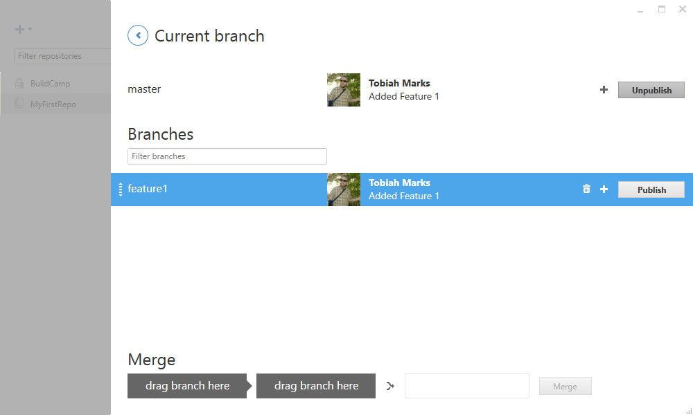

Session 4: Introduction to Git and GitHub
================================================================
##Part 3: Branching

Now we start to touch on stuff that is a bit more complicated.

###What is branching?

When you make commits on git, you end up with a series of snapshots of the code in various states. What if you wanted preserve the code in different states?

For instance, you might have a version that is your 1.0 release, and another 1.1 version for your in-progress new feature update.

What if while you are developing your code, somebody finds a major bug that you need to fix from your master version right away? The new feature you are working on isn't finished yet, and needs more work. Do don't need to discard and revert all your hard work in order to get access to the 1.0 code if you set up a new branch for your master and in-progress code.

What if you have a master version of your code, and you want to mess around and change things just for testing? You should be able to commit all your work. You shouldn't be afraid to commit test changes because you would then have to remember what you changed and when in order to revert them back. Just make a new test branch instead that won't effect your master version.

Branching allows you to organize your commits and keep track of multiple versions of your code.

This may sound weird at first, but it gets simpler once you see it in action.

###Create a branch

By default, all git projects have a "master" branch. There is a drop down box that says "master" on top of your commit log. Click it to expand the drop down menu to view all your current branches.

To see more options, click the manage button on the right of the branches drop down.

Since we only have one branch, not much is going on in this screen right now.

To make a new branch, go back to your main project screen. The text box should say "Filter or create new". Type the name of the new branch you want.

Now you have two branches. master, and feature1!

###Switch between branches

To switch between, click on the drop down menu again.

Try selecting feature1 and make a new commit.

Now switch back to master branch. You'll see that your new commit disappears. If you check your folder, the files are automatically changed. When you're ready to work on your new feature again, select the branch again and you can continue working.

###Deleting branch
To delete a branch, you'll need to go to your branch manager again. To get there, click the branches down down menu again and hit the manage button on the top right.

You can't delete the current branch you have "checked out" (the one you have open). Other branches appear below, simply click the trash can to delete them.

##End of Part 3

[Click here](../README.md "Open main readme") to return to the main workshop readme, or [click here](../Part4/README.md "Open Part 4") to skip directly to Part 4.