Session 4: Introduction to Git and GitHub
================================================================

##Part 4: Merging and Rebasing
Now that you've made multiple branches, it's time to learn how to put them back together!
###Merging branches
To merge our "feature1" branch from the last part back into our master branch, go back to your branch manager. To get there, click the branches drop down and hit manage.

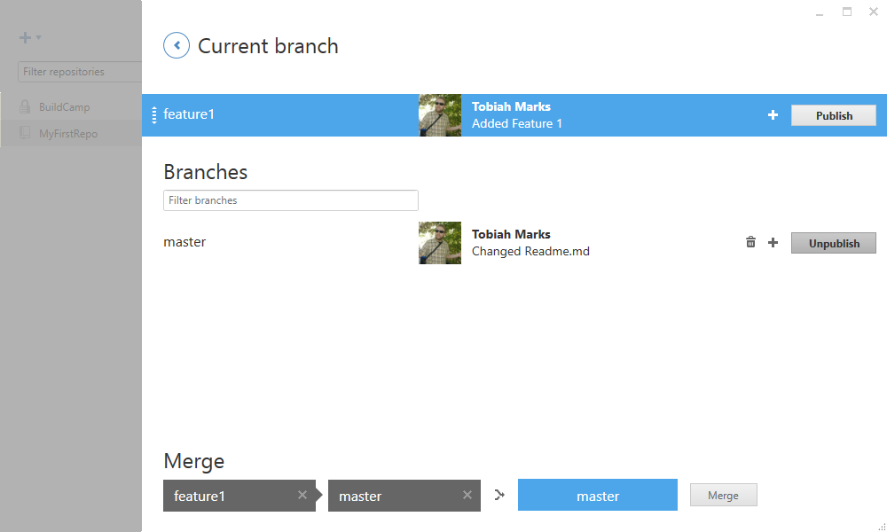

Drag the "feature1" into the blank box on the left under "Merge", and "master" onto the blank box on the right.

That will tell the GitHub client to merge the commits from "feature1" into the branch of "master". You can confirm that you've done this right (as opposed to the other way around) if the blue box on the far right also says "master".

Click the merge button, and because there were no conflicts "master" now matches "feature1".

### Viewing branch graph

For this tutorial, I've been trying to stay away from doing shell commands. But, when it comes to merging, it eventually becomes unavoidable to use some text based commands.

To open the shell, click Settings->Open in Git Shell.

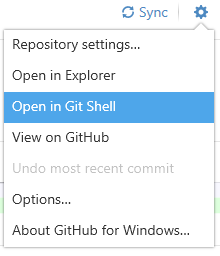

I won't go over all the basic commands here, but in the shell you can do everything we've done so far in the GitHub client and more, with more options.

Specifically when dealing with multiple branches, viewing a graph may be useful. Try typing in this line:

`git log --graph --oneline --all --decorate`

As an example, I made another new branch called "feature2". In both "feature1" and "feature2" branches I made new commits.

When I open the Shell and run the above command, I get this useful graph:

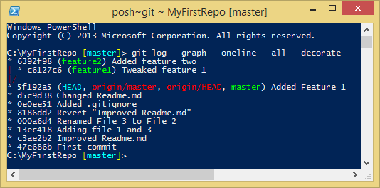

It may be ASCII art, but you can see the relationship between on the branches.

"HEAD" is the current branch. "origin/master" and "origin/HEAD" are the remote (aka "origin") branches on GitHub. If we published the "feature1" or "feature2" branches, another "origin/feature1" or "origin/feature2" tag would also appear for the remote versions of those branches.

###Resolving conflicts

As amazing and useful as Git is, sometimes things don't go as planned.

Let's take our current project. We've been working on two different branches, one improving feature 1 and another creating a feature 2. However, they both have been working on `Features.txt`

First, let's merge "feature1" with "master".

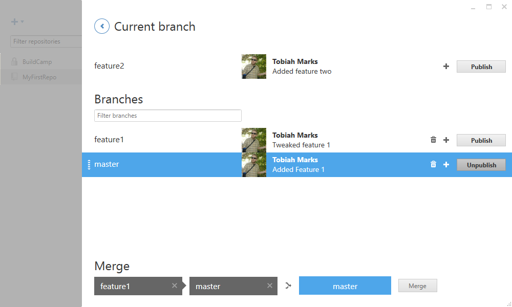

So far so good. But, what happens when we try to then merge "feature2" with "master"?

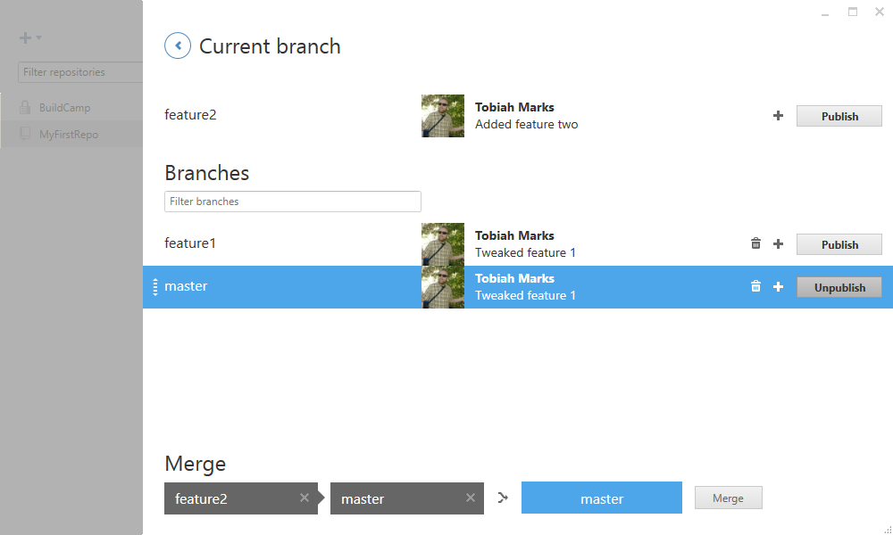

Things don't go quite as smoothly...

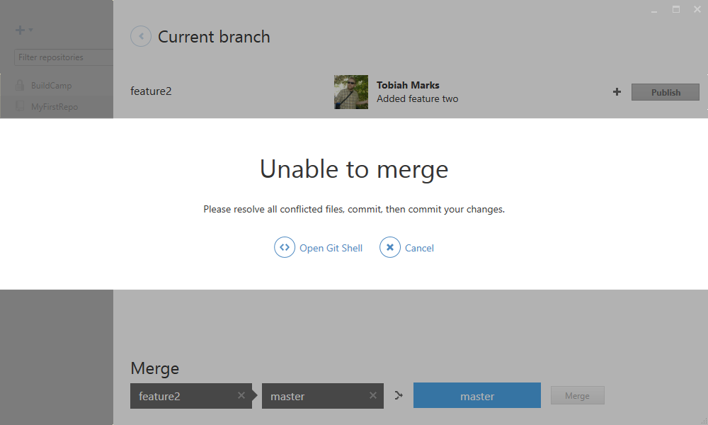

It's time to break out the Git Shell again.

Our project now exists in a semi limbo state mid-merge.

If we wanted to give up and abort this merge, we can stop it by typing:

`git merge --abort`

We don't need to abort it though, let's try to fix it instead. Use the diff command to see where the conflict is.

`git diff`

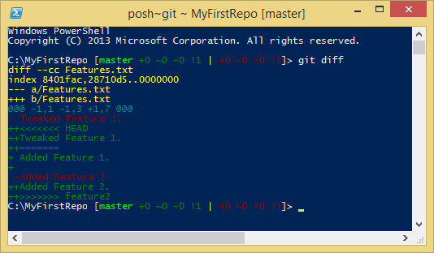

Yep, we know the exact problem. You can see the "feature1" and "feature2" versions are at odds at each other.

It's here you could use something like `git mergetool` to help resolve these conflicts and chose which lines from branch A and which from branch B to use. But since this is simple, we will go in manually and fix it.

Let's open up `Features.txt`.

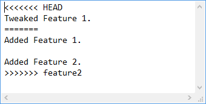

Git has added at each conflict, the <<<<<<<, =======, and >>>>>>>. The first part represents the "HEAD"/"master" branch, and the second part after the equals signs represents the "feature2" branch.

Let's change this to something we want, a mix of the two.

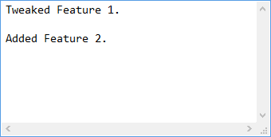

Now let's go back to git. We now have to readd all the conflicted files to the project and commit. To see which files are or are not part of a current commit, we can use `git status`

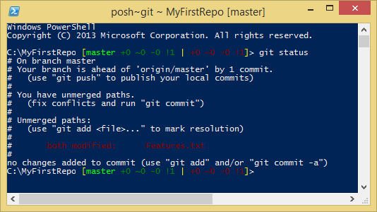

We see that Features.txt is not resolved. As the message says, we just need to type `git add Features.txt` and then `git commit` to finalize the merge.

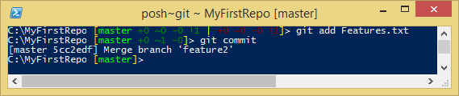

Now if we look in the GitHub client, we see our merge has gone through.

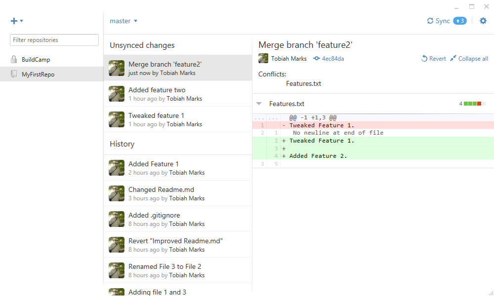

###Undoing an merge

If we aren't happy with this merge, we can always revert as we learned in part 1, or by going back to the git shell and typing: 

`git reset --soft HEAD~1`

The `git reset` reverts us back to an earlier commit. The "`--soft`" option means that instead of discarding the changes, it puts them back into our workspace for us to edit. `HEAD~1` means we are reverting to the last commit (The current one being `HEAD`, so the one right before `HEAD` is `HEAD~1`)

That would undo the merge, or whatever the last commit just did. Since our "feature2" branch hasn't changed, we can always merge again if desired.

###Rebasing
Instead of merging, git also has "rebasing".

Rebasing takes a branch and integrates all its commits into another branch.

Functionally, it acts very similar to merging. You have to use it from the git shell. Instead of `git merge <branch>`, you do `git rebase <branch>`

###When should you merge and when should you rebase?
At first merging and rebasing might seem to give you the same result. The code gets all mashed together! But, there is a key difference between the two.

Merging takes all the changes in one branch, then in one commit applies those differences into another branch.

Rebasing says I want to take all the commits in my current branch, and change the "base" at when the branch initially started at.

So when would you want to use one vs. the other?

#### You might want to merge when...
You made a branch for a new feature. After you've coded it and bug tested the feature and ready to bring it into your main code, you probably want to merge.

In this case, you don't care about maintaining all the interim commits, but simply want the final product of that branch.

#### You might want to rebase when...
You were developing in branch A, and another developer working from branch B wants to integrate their work with yours. 

In this case, you want to preserve all the interim commit steps and documentation they have been working on. By rebasing, you get not just the final code but all the steps that the developer took as if they had also been working on branch A the whole time.

##End of Part 4

[Click here](../README.md "Open main readme") to return to the main workshop readme and read the summary.