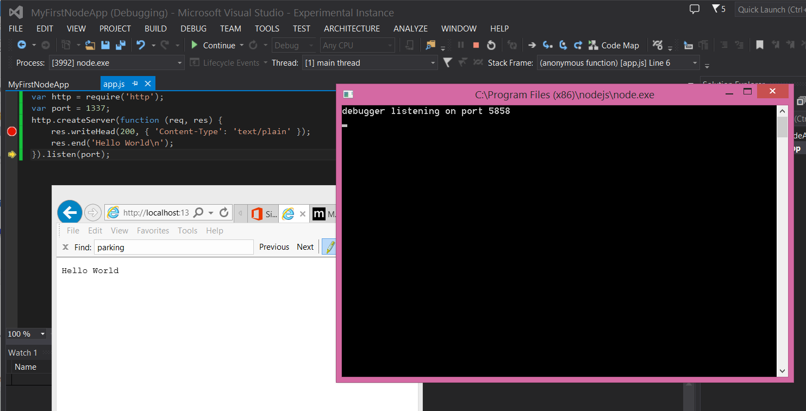
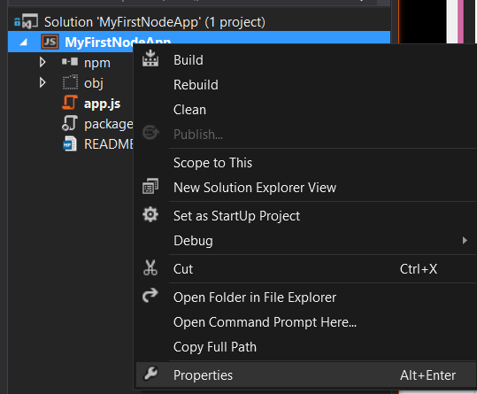
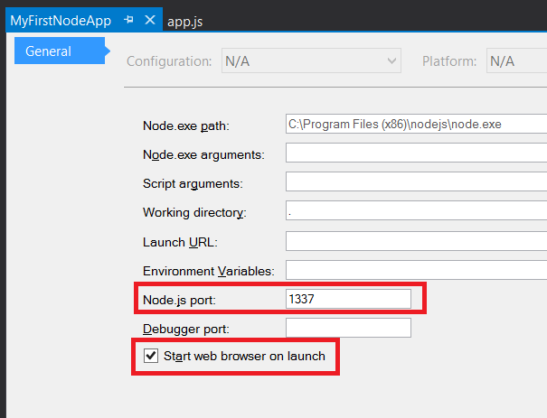
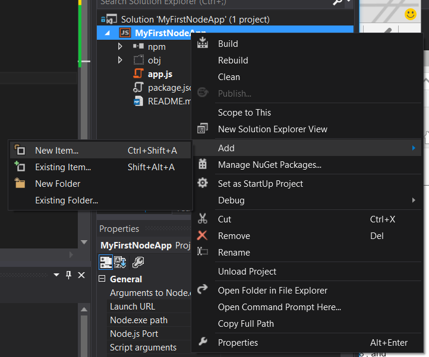
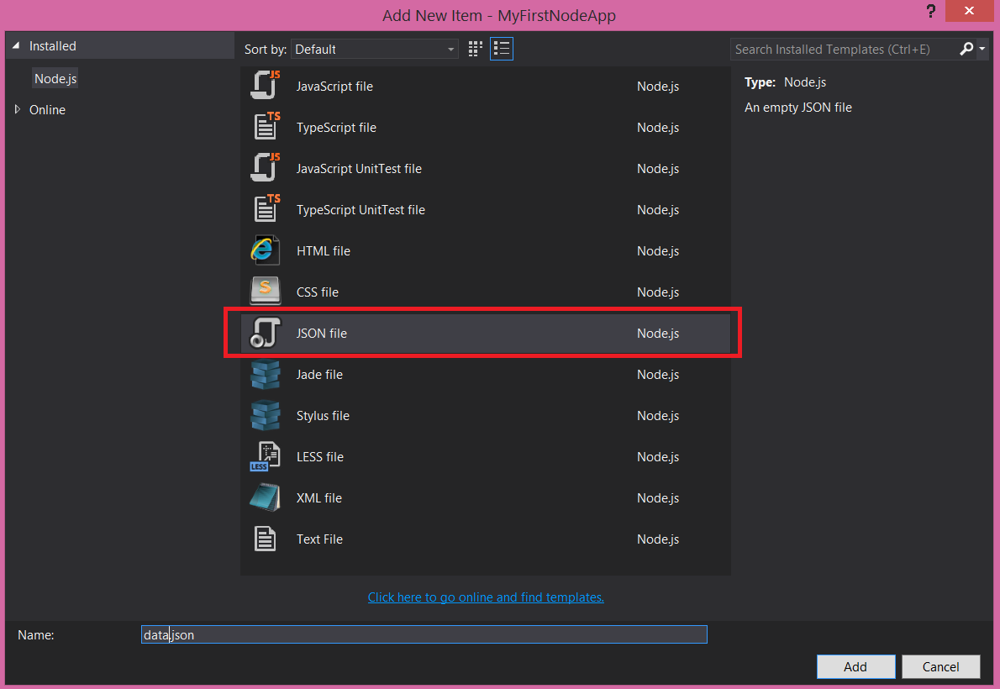
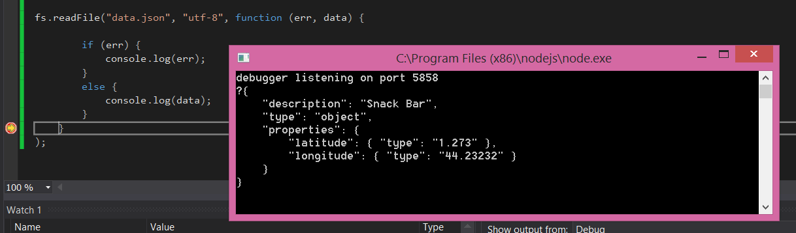
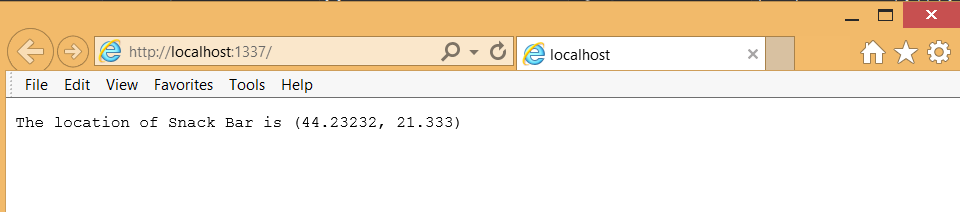

Session 6: Introduction to Node.js
==================================

#Objective

After the end of this lab, you will know how to:

	1. What Node.js is
	2. How to create a basic Node.js application
	3. Asynchronous programming using callbacks
	4. Creating basic web server

#What is Node.js?

Node.js is an asynchronous Input/Output (I/O) engine optimized for server applications and focuses on driving as much throughput as possible in the application. Throughput can be thought of as the measure of how much an application can process concurrently.

Node uses javascript, the same language that runs in web browsers to perform application logic. This creates a more familiar development environment for developing on the server side of web applications.

#Creating your first Node.js application

Creating a Node server with Visual Studio is super easy. First create a new Node.js web app project by going to <b>File->New...->Project...-> Blank Node.js Console Application</b>:

 

This will generate basic Node.js application with your simple "Hello World":

    console.log('Hello world');

The application is just a console application and will just print out "Hello World" to the console output:

 

#Creating a Web Server

The most popular use of Node is its built-in HTTP server functionality. In the demo above we created a simple console application that printed out a message to screen. WE can do something more interesting by using the **http** module to create a web server.

Add this line of code which imports the http module:

    var http = require('http');

This creates a module, http which is a bundle of library code which lets us create an HTTP (web) server.

Next, we need to pick a **port number** we should use for our application. Ports can be thought of as an apartment number in an apartment building. The apartment building is your computer and the port number specifies which apartment in that building your Node application can be found running in.

Lets create a quick port variable here for good measure:

    var port = 8080

You should be fine using port 8080. Only one application can run in each port so it is important that you don't run another web server on port 8080. When you deploy your app to the cloud, port 80 will be used.

Now that we have the http module and the port variable, we can start a web server with the **http.createServer** method:

    http.createServer(requestListener).listen(port);

This will create a web server but won't actually do anything if you run the application.

Before we can start the server we need to define requestListener object. The official api [documentation](http://nodejs.org/api/http.html#http_http_createserver_requestlistener) specifies that **requestListener** is a function that takes two parameters req, res (short for request, and response). Request is an object of type [HttpIncomingMessage](http://nodejs.org/api/http.html#http_http_incomingmessage) and response has the type of [ServerResponse](http://nodejs.org/api/http.html#http_class_http_serverresponse).

This function is responsible for processing and responding to all requests coming from the client, in this case a web browser:

    var requestListener = function(req, res) {
		
		//Write the the response header with a status code of 200 (For HTTP OK)
		//And with a plain text content type
		res.writeHead(200, { 'Content-Type': 'text/plain' });

		//end() will write the specified string to the response
    	res.end('Hello World\n');
	}

**writeHead** is a method which writes to the header portion of an HTTP message. The header is responsible for providing metadata about the HTTP message. The 200 means the response is an HTTP OK type of message indicating that the operation was successful. Content-type tells the browser how to display the information in the body. Other content types include HTML for web pages, and JSON for web APIs.

**end** writes the specified string to the response body of the HTTP message.

Putting it all together:

    var requestListener = function(req, res) {
		
		//Write the the response header with a status code of 200 (For HTTP OK)
		//And with a plain text content type
		res.writeHead(200, { 'Content-Type': 'text/plain' });

		//end() will write the specified string to the response
    	res.end('Hello World\n');
	}

	http.createServer(requestListener).listen(port);

Or using an anonymous function we can shorten this to:

	http.createServer(function(req, res) {
		
		//Write the the response header with a status code of 200 (For HTTP OK)
		//And with a plain text content type
		res.writeHead(200, { 'Content-Type': 'text/plain' });

		//end() will write the specified string to the response
    	res.end('Hello World\n');
	}).listen(port);

You should consider using anonymous functions when you don't plan on reusing the function in many places.

Place a breakpoint on the res.writeHead line. Then run the application by pressing F5 or click the play button in Visual Studio. When the application starts go to your web browser and navigate to **http://localhost:1337**:

 

###Setting the right port number

Often times you shouldn't use a static number to define the server port number and instead you should use what's called an environment variable. This allows your application to run in many environments such as the cloud.

To do this change the **port** variable to use the PORT environment variable:

    var port = process.env.PORT || 1337;

The behavior of the logical OR operator will default to use the PORT environment variable first. If that isn't specified it will use port 1337.

For this to work, the Node.js port value needs to be set in your project properties. Right click on the the project and click on **Properties**

In the properties dialog set the Node.js port to 1337 and while we are at it, to make things easier, check '**automatically start web browser**' so that the browser starts everytime we start app:

Here is your code put all together:

    var http = require('http');
	var port = process.env.PORT || 1337;
	http.createServer(function (req, res) {
		//Write the the response header with a status code of 200 (For HTTP OK)
		//And with a plain text content type
    	res.writeHead(200, { 'Content-Type': 'text/plain' });
		
		//end() will write the specified string to the response
    	res.end('Hello World\n');
	}).listen(port);

#Understanding Callbacks: Reading a file with Node.js

So far we've created a web server with a listener that wrote 'HelloWorld' to the output of the screen. To show how you do asynchronous programming in Node.js we will read data from a text file and write the text to the response message.

First things first is that we need to import the file system module **fs**. Its a good idea to keep all of your **require** statements together on the top of your .js file:

    var http = require('http');
	var fs = require('fs');
	var port = process.env.PORT || 1337;

	http.createServer(function (req, res) {

		//Write the the response header with a status code of 200 (For HTTP OK)
		//And with a plain text content type
    	res.writeHead(200, { 'Content-Type': 'text/plain' });
		
		//end() will write the specified string to the response
    	res.end('Hello World\n');
	}).listen(port);

Next to your **app.js** file create a new file called **data.json**:

Copy and paste the following JSON text (which represents a location of a snack bar) to the file:

    {
    	"description": "Snack Bar",
    	"type": "object",
    	"properties": {
    	    "latitude": { "type": "number" },
    	    "longitude": { "type": "number" }
    	}
	}

Now lets try reading the data in the file. Using the readFile method in the fs module. According to the [documentation](http://nodejs.org/api/fs.html#fs_fs_readfile_filename_options_callback) the readFile method takes 3 arguments, the first which is a string which represents the path to the file, the second which is the encoding of the file and the last of which is a **callback**.

	fs.readFile('data.json', 'utf8', function (err,data) {
  		if (err) {
    		return console.log(err);
  		}
  		console.log(data);
	});

Visual Studio creates all files with UTF-8 encoding and its the most common encoding you will encounter. In fact, you can just drop that argument and readFile will default to this encoding.

The **callback** function is very important and used heavily throughout Node.js programming. The convention of a callback is to have the first parameter be the error (which is null if there is no error) and the following parameter is the resulting data from the original function call. If a callback has no data to return it will just return 1 parameter.

**The typical signature of a callback**

    function (err, data)

The callback's functionality is very intuitive from the name. Node.js will call this function back once the data from the call to readFile has been fetched and is ready to be worked with.

The object types of **err** and **data** are specific to the method being called so you should check the documentation or use a code example to understand how to use the callback parameters.

Run the program and you should see the JSON text content in the file print to the console screen:

Now, let's output the file data to the browser instead of the console. In order to this we need to place the call to readFile inside the server message handler:

    http.createServer(function (req, res) {
    
	    //Write the the response header with a status code of 200 (For HTTP OK)
	    //And with a plain text content type
	    res.writeHead(200, { 'Content-Type': 'text/plain' });
	
	    fs.readFile("data.json", "utf-8", function (err, data) {
	        
	            if (err) {
	                console.error(err);
	            }
	            else {
	                //end() will write the specified string to the response
	                res.end(data);
	            }
	        }
	    );

	}).listen(port);

Because the **res** object is within the closure of the readFile method the callback has access to the object and can write the result of the callback deta to it.

Since the data in the data.json file is JSON, we can easily parse the text in the file into an object using the standard javascript functon JSON.parse:

    var contentObject = JSON.parse(data.trim());
                
    res.end('The location of ' + contentObject.description + ' is located at ' + '(' + contentObject.properties.longitude + ', ' + contentObject.properties.latitude + ')');  

This will parse the content into a javascript object which allows us to easily use and manipulate the data: 

 

Putting it all together:

	var http = require('http');
	var fs = require('fs');
	var port = process.env.PORT || 1337;
	
	http.createServer(function (req, res) {
	    
	    //Write the the response header with a status code of 200 (For HTTP OK)
	    //And with a plain text content type
	    res.writeHead(200, { 'Content-Type': 'text/plain' });
	
	    fs.readFile("data.json", "UTF-8", function (err, data) {
	        
	            if (err) {
	                console.error(err);
	            }
	            else {
	                //end() will write the specified string to the response
	                var contentObject = JSON.parse(data.trim());
	                
	                res.end('The location of ' + contentObject.description + ' is located at ' + '(' + contentObject.properties.longitude + ', ' + contentObject.properties.latitude + ')');  
	            }
	        }
	    );
	}).listen(port);

There's your crash course. We will use JSON more extensively in Tuesday's lab.