Session 6: Creating your web Backend with Node.js
=============

#Objective

In this lab we are going to create the back-end web service for the BartNOW web app which will supply the data about stations, store your favorite stations and provide estimated times of arrival.

After the end of this lab, you will know:

	1. What Express is
	2. What an API route is
	2. How to create a web API using Express
	3. RESTful convention
	4. How to test your apis

#What is Express?

Express is a web application framework for node which simplifies creating web applications by removing a lot of the low level details that we had to deal with in the previous Node session.


#Understanding Web APIs


A web API is just an address to a web server (such [this one](http://bartnowapi.azurewebsites.net/api/stations/POWL)) which provides textual data (non-visual) to power applications on any device. There are countless APIs all over the web you can use from Geolocating to Facial Recognition.

You can use an [HTTP request](http://eloquentjavascript.net/chapter14.html) to access this data in a Web API programatically. This was discussed in the previous angular.js lab.

Here's an example REST request:

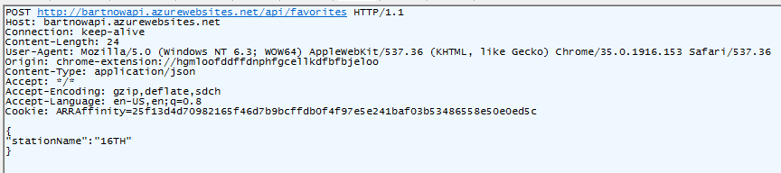

RESTful transactions have 3 important parts to them:

###HTTP Method

There are 4 common HTTP methods that are used in REST requests:

	- GET
		- Side affect free
		- Provide data to client
		- Do not have content body
	- POST
		- Should have side affect
		- May provide small amount of data back to client
		- Do have content bodies for uploading data
	- PUT
		- Should have side affect
		- May provide small amount of data back to client
		- Do have content bodies for uploading data
	- DELETE
		- Should result in the removal of some data on server
		- May provide small amount of data back to client
		- Should not contain content in the body

'**Side affect** free' means that the state of the data on the server hasn't been changed after the request was made.

###URL/Query Parameters

Ever browse to a webpage and see a '?' in the address bar? Those indicate that a URL parameter is included in the message.

An example of URL parameters in an api request address is:

    https://graph.facebook.com/api/me?fields=picture

The above api route on this Facebook API is specifying a URL parameter **fields**. Every URL parameter is a key-value pair. In this case the key is 'fields' and the value is 'picture'.

If you have more than one query parameter they can be separated by '&':

	https://graph.facebook.com/api/me?fields=picture&limit=30

In this case we have 2 API parameters, **picture** and **limit**. Notice how limit is preceded by an '&'.

###Content body

A **content body** can be thought of as a payload for the message. You can place anything in a content body, from JSON data to a photo of your best friend. In the example Rest request the content body was:

    {
		"stationName":"16TH"
	}

###Response

REST requests ALWAYS have a response (unless something goes wrong) which indicates to the web application if the REST request was successful. An example response to the REST request above is:

    HTTP/1.1 201 CREATED
	Content-Length: 785
	Content-Type: application/json; charset=utf-8
	Content-Encoding: gzip
	ETag: "-2054519282"
	Vary: Accept-Encoding
	Server: Microsoft-IIS/8.0
	X-Powered-By: Express
	Access-Control-Allow-Origin: *
	Access-Control-Allow-Headers: X-Requested-With
	X-Powered-By: ASP.NET
	Date: Tue, 01 Jul 2014 23:32:06 GMT

	{"message":"Sucessfully added to favorite stations"}

You don't have to worry too much about all the good in the message. All that is you know that a response may have a **content body** and will always have a **status code** which indicates if the request was successful.

Express makes handling REST requests much easier and hides all the gooey details like you see in the request messages above.

#Getting Started

###Development Environment

Open up the starter solution [**StartProject/BartNOWWebService.sln**](StartProject/BartNOWWebService.sln) in Visual Studio.

When the solution is opened, if you aren't prompted to install dependent packages, under the project in the Solution Explorer, right click on **npm->Install missing npm modules**:

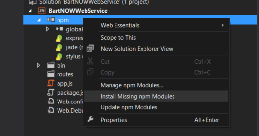

You need to do this because the packages aren't kept in the git repository and must be downloaded to your local directory.

Add the the **routes** folder to the solution as well. We will need it to hold our route definition javascript files:

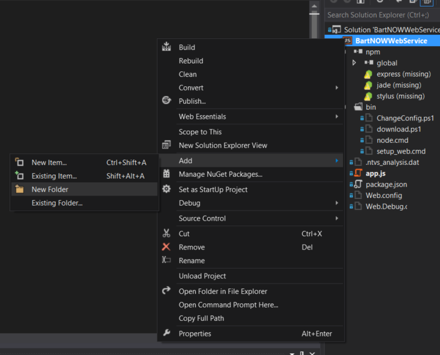

Your project should look like this now


Now run the starter project and you should see the following output on your console:

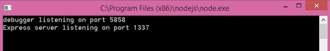

You server is now running! However it won't do much. Keep moving forward in the guide and to have your server do some actual work.

###Installing Test REST client

Its good for us to test our back-end without needing our web app client. A useful tool we will use in this lab a chrome extension called **[Advanced Rest Client](https://chrome.google.com/webstore/detail/advanced-rest-client/hgmloofddffdnphfgcellkdfbfbjeloo)**. If you don't already have it download the **[chrome](https://www.google.com/chrome/browser/)** browser to install the extension.

#Creating a Route

[Express routes](http://www.javascriptatoms.com/2014/01/create-url-route-node-js-express/) define how the server 'routes' the request to a particular handler which performs the request operation. In the above REST request example you can think of the route as the **'api/favorites** part of the url. 

This backend service will have the following routes:

	1. GET - /api/stations

	2. GET - /api/stations/<STATION_ABBREVIATION>

Let's create the first api. In your Visual Studio solution, add a new javascript file under the **routes** folder and name it **stations.js**:

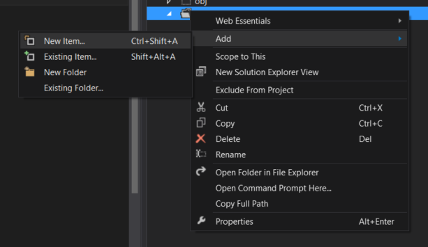

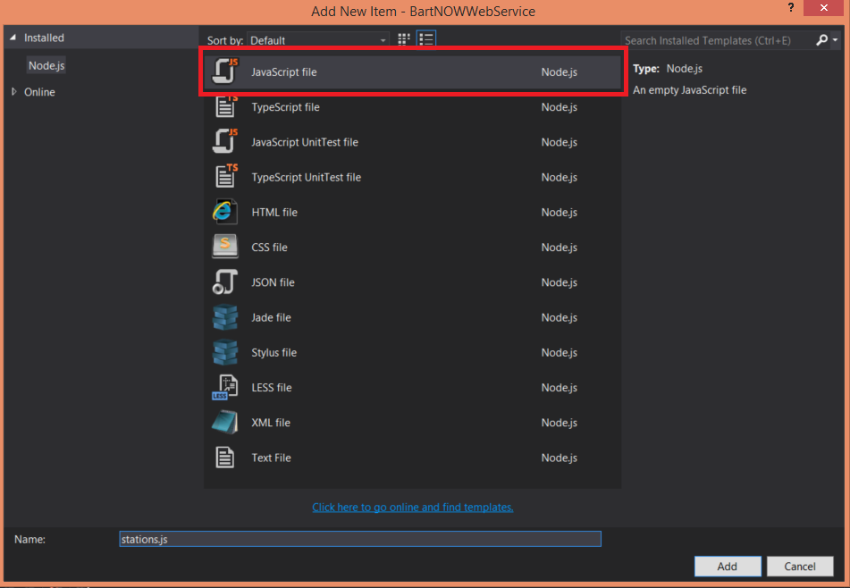

Node.js uses [RequireJS](http://www.requirejs.org/) for its module system and **stations.js** will create a new module. We will use the **exports** keyword to define the **get** property of this route which will be a function:

```js    
	//stations.js	
	/*
	* GET /api/stations
	*/
	exports.list = function (req, res) {
	    
	    //respond to our request with a simple answer
	    res.send({
	        message : "Successfully called station api"
	    });
	
	    return;
	
	}
```
In **app.js** add the reference to the module we just created above:

```js
    var stations = require('./routes/stations.js');
```
The **stations** module exports the **get** function. We can assign the exported **get** function to the **/api/stations** route on our express app object, which tells express that we should assign this handler for all **GET** REST requests which refer to the url path '**/api/stations**:

```
    app.get('/api/stations', stations.get);
```

Run your application and you should see the same console message pop up as before. However now it has an API available that we can call. To test this route out navigate to the **Advanced Rest Client** chrome extension. 

We must make the REST request **GET /api/stations** in order to get a response from our server located at http://localhost:1337. In Advanced Rest Client, set the url address to the full address of the API, **http://loclahost:1337/api/stations**. Set the request type to GET and click 'Send':

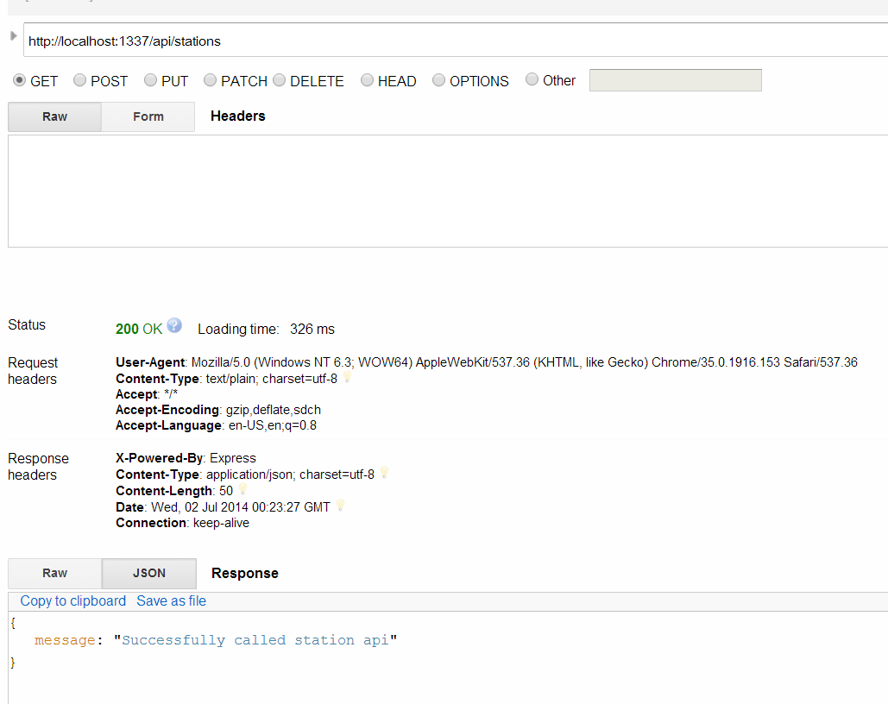

On your sever console you should see a successful 200 response from your server logged:

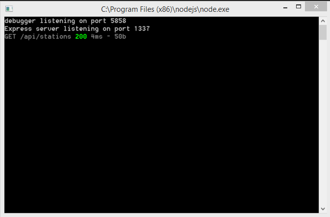

Now you can confirm that your API works as expected!

##Getting Live Subway Data

BartNOW uses the [BART api](http://api.bart.gov/docs/stn/index.aspx) to display live subway times. Up to now you've been using a static .json data file to provide the data We will use the BART API to provide live data to our server.

Our API will call the Bart data service API to provide us with real-time data to our app. First, you must [aquire a free API key](http://www.bart.gov/schedules/developers/api) from Bart. The BART Api is also unique in that it has a [**pulic api key**](). That key is **MW9S-E7SL-26DU-VV8V**. 

API Keys allow Web API owners to manage developers who use the API. They can use it to allow, disallow or throttle API calls from other applications. **Keep your API key a secret!**

Once you get your API key from BART (via email), place your key in an environment variable of your project properties by adding **API_KEY=<YOUR_API_KEY_HERE>** to the Environment Variables text box:

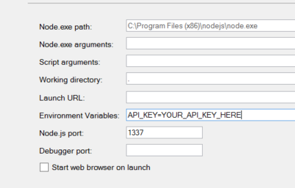

Express is great at *recieving* REST requests but doesn't really offer much in the way of *making* REST requests easily. **Unirest** is a node.js module which makes life easy for making REST requests in Node. 

Install Unirest by right clicking **npm** under your project:

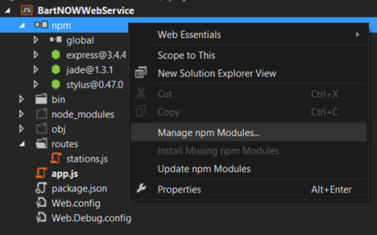


You'll be presented with the npm Package Manager. You can download a variety of useful node.js modules for just about anything you can think of. You can visit [npm](http://npmjs.org) to look up the documentation for any listed package.

Search for **unirest** and click **install**

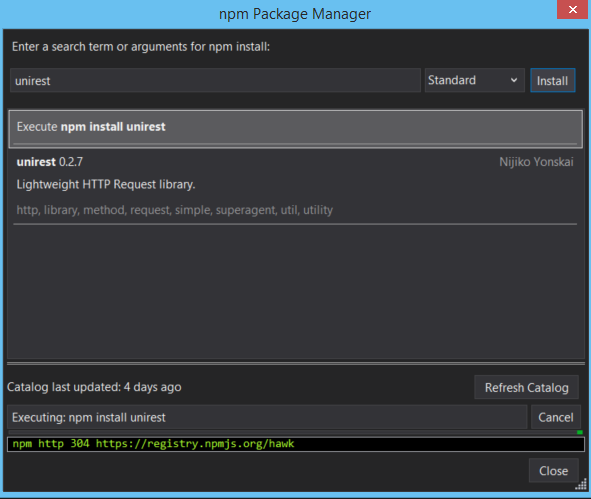

Npm will install the package and now we can pull the unirest module into to **stations.js** by adding the require statment to the top of the file. Remember, you should always put your require's on top of your file so that its clear what module's you are using.

```js
    var unirest = require('unirest')
```

**Implementing the API GET - /api/stations**

Our REST API will need make a similar REST call to the BART service to provide the data back. The api we need to call is that station listing api:

	GET - http://api.bart.gov/docs/stn/stns.aspx?key=<YOUR_API_KEY>

The [official Bart API](http://api.bart.gov/docs/stn/stns.aspx) actually responds with a response format called **XML**. Because  isn't ideal for this lab and to avoid complexity we will call this similar API we have created to provide the data in JSON:

	GET - http://bartjson.azurewebsites.net/api/sts.aspx?key=<YOUR_API_KEY>

The API will expect a URL parameter **key** which is your API key that you got when you registered. The response format is expect to to be an array of JSON objects:

```json
    [
	  {
	    "longitude": "-122.271604",
	    "latitude": "37.803664",
	    "name": "12th St. Oakland City Center",
	    "abbr": "12TH",
	    "county": "alameda",
	    "state": "CA",
	    "zipcode": "94612"
		"etd" : [
			{
				"abbreviation": "FRMT"
				"destination": "Fremont"
				-estimate: [
					{
						"minutes": "Leaving",
						"length": "6",
						"color": "ORANGE",
						"bikeflag": "1",
						"platform":: "2"
					},
					{
						"minutes": "6",
						"length": "6",
						"color": "ORANGE",
						"bikeflag": "1",
						"platform":: "2"
					}
					...
				]
			},
			{
				"abbreviation": "PITT"
				"destination": "Pittsburg/Bay Point"
				-estimate: [
					{
						"minutes": "Leaving",
						"length": "6",
						"color": "ORANGE",
						"bikeflag": "1",
						"platform":: "2"
					},
					{
						"minutes": "6",
						"length": "6",
						"color": "ORANGE",
						"bikeflag": "1",
						"platform":: "2"
					}
					...
				]
			}
		]
	  },
	  {
	    "longitude": "-122.419694",
	    "latitude": "37.765062",
	    "name": "16th St. Mission",
	    "abbr": "16TH",
	    "county": "sanfrancisco",
	    "state": "CA",
	    "zipcode": "94110"
		...
	]
```
In the output of this api call we get a list of 44 BART stations as well as the upcoming real-time departures for each station.

Now that we know what API to call we can make the request within our **stations** api handler using the **unirest.get** function which sends a GET request to a web API:

**stations.js**

```js
	exports.list = function (req, res) {
		unirest.get('http://bartjson.azurewebsites.net/api/stn.aspx?key=' + process.env.API_KEY,
	    	function (apiResponse) {
	
	    	}
		);
	}
```
Thus makes our GET request to the Bart API. Unirest.get calls the API and once it gets the response from API, it will execute the callback function provided to it with a **response** object.

According to the [unirest documentation](https://www.npmjs.org/package/unirest), response.error will contain an error message if there was an error. Its good practice to check if something went wrong and respond appropriately:

**stations.js**
```js
	exports.list = function (req, res) {
		unirest.get('http://bartjson.azurewebsites.net/api/stn.aspx?key=' + process.env.API_KEY,
	    	function (apiResponse) {

				if(apiResponse.error){
					//indicate to the caller that there was an internal server error (code 500) and sent the error message
					res.send(500, {message: apiResponse.error});
					return;
				}

				
	    	}
		);
	}
```

Finally, **response.body** will contain the content body of the message. The body was in JSON is and is automatically parse as a javascript object. We can simply send this back to client:

```js
    exports.list = function (req, res) {
		unirest.get('http://bartjson.azurewebsites.net/api/stn.aspx?key=' + process.env.API_KEY,
	    	function (apiResponse) {

				if(apiResponse.error){
					//indicate to the caller that there was an internal server error (code 500) and sent the error message
					res.send(500, {message: apiResponse.error});
					return;
				}
				
				res.send(apiResponse.body)
				
	    	}
		);
	}
```

Place a breakpoint at **resp.send(apiResponse.body)**. Start up the application and use Advanced Rest Client to test the API. Example the apiResponse.body:

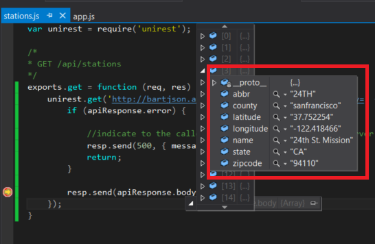

Visual Studio will unfold the array in the **apiResponse.body**. Now lets take a look at the response seen from the test REST client:

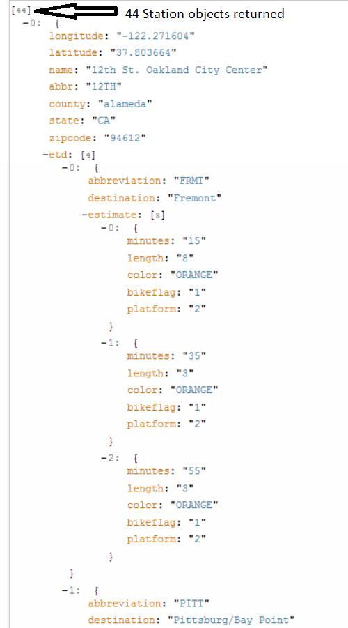

Congratulations you've hooked up the first api!

###Extra: Returning Stations by Geographic proximity

(to do this part, install the npm module [**stable**](https://www.npmjs.org/package/stable) in the package manager.)

Add the require to the station.js file:

```js
    var stable = require('stable');
```

This is great! However by default the BartAPi gives us the list of stations by alphabetical order. It would be more useful if we could sort the collection by nearest location.

Since the data from the Bart API contains latitude and logitude, we can calculate the distance between a given point and the point of each station, and order the stations by nearest to farthest.

Lets start by creating a function that will take 3 parameters, **lat, lon, and stationData**. The first two represents the geographic location, and stationData is the stations array returned by the Bart Api:

```js
    function sortByLocation(lat, lon, stationData) {
		
		
	}
```
First we need to compute the distance between the provided lat and lon with the distance of each station. Remember the distance formula? sqrt((y1 - y2)^ + (x1-x2)^2):

```js
    Math.sqrt(Math.pow(lat - stationData[i].latitude, 2) + Math.pow(lon - stationData[i].longitude, 2));
```

We can actually dynamically add fields to each station object by simply assigning a value to a newly name property. This is one of the best things about javascript:

```js
	//compute distances from lat lon to each station
    for (var i in stationData) {
        var stationObject = stationData[i];

        //calculate distance from point and add data to each station

        stationObject.distance = Math.sqrt(Math.pow(lat - stationData[i].latitude, 2) + Math.pow(lon - stationData[i].longitude, 2));
    }
```

Debugging you can see that we've added the distance data to the **stationObject**:

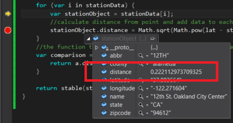

Now let's deal with sorting the station array. We don't really have to do much actually. Since **stable** is a sorting library it can do it for us. We can use the **stable.sort** function which takes the array to perform the sort and a function which is called with two variables **a** and **b** which defines returns true if **a > b** where a and b are items in the array **stationData**:

```js
    return stable(stationData, function (a, b) {
        return a.distance > b.distance;
    });
```

All together the function to be placed in station.js looks like:

```js
    /**
    Sorts a given array of stations with the first element being the closest statioand the
    last being the farthest. Returns the sorted array
	**/
	function sortByLocation(lat, lon, stationData) {
    
	    //compute distances from point
	    for (var i in stationData) {
	        var stationObject = stationData[i];
	        //calculate distance from point and add data to each station
	        stationObject.distance = Math.sqrt(Math.pow(lat - stationData[i].latitude, 2) + Math.pow(lon - stationData[i].longitude, 2));
	    }
	    //the function that defines the comparison between 2 stations
	    
	    return stable(stationData, function (a, b) {
	        return a.distance > b.distance;
	    });
	}
```
Now in the api get handler we can accept query parameters for **lat** and **lon** on the on our REST api by checking for **req.query.lat** and **req.query.lon**:

```js
    if (req.query.lat && req.query.lon) {
        //caller specified a reference location
        res.send(sortByLocation(req.query.lat, req.query.lon, apiResponse.body));
    }
    else {
		//no lat and/or lon specified so just return the alphabetical array
        res.send(apiResponse.body);
    }
```

To validate that these optional parameters we first should pick a reasonable latitude and longitude from a [map](http://www.bing.com/maps/):

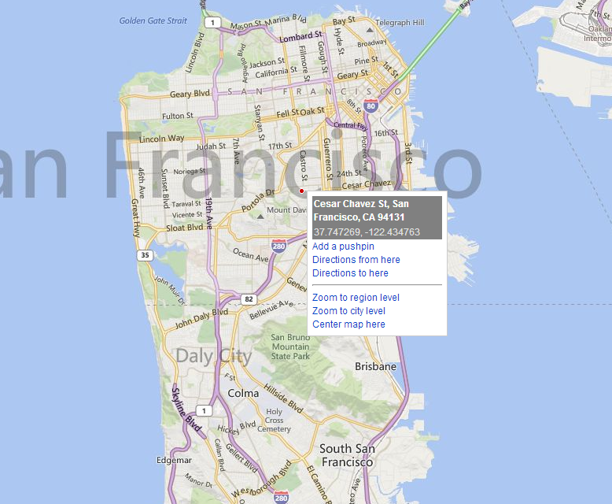

And call the api with Advanced Rest Client to validate the sorting:


Notice the ordering of the response data lists San Francisco BART stations first, and lists East Bay stations toward the end.

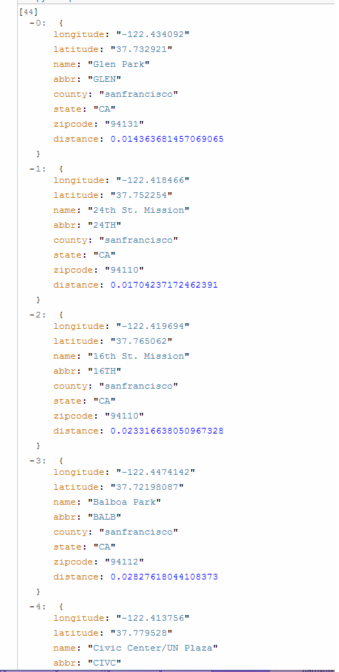

##Getting Real-Time Train Estimated Arrivals

Whats the use of a mobile BART application if it doesn't tell you when your next train is coming?

The Bart API offers [an api](http://api.bart.gov/docs/etd/etd.aspx) which can give us real time estimated arrivals of any station on the system.

A call to the **GET http://bartjson.azurewebsites.net/api/etd.aspx?cmd=etd&orig=STATION_ABBREVIATION&key=YOUR_API_KEY** returns us the following JSON format:

```json
    [40]
		0:  {
		abbr: "LAKE"
		name: "Lake Merritt"
		etd: [3]
			0:  {
			abbreviation: "DALY"
			destination: "Daly City"
			minutes: "Daly City"
			}-
			1:  {
			abbreviation: "FRMT"
			destination: "Fremont"
			minutes: "Fremont"
			}-
			2:  {
			abbreviation: "RICH"
			destination: "Richmond"
			minutes: "Richmond"
			}
		}
		1:  {
		abbr: "FTVL"
		name: "Fruitvale"
		etd: [2]
			0:  {
			abbreviation: "DUBL"
			destination: "Dublin/Pleasanton"
			minutes: "Dublin/Pleasanton"
			}-
			1:  {
			abbreviation: "FRMT"
			destination: "Fremont"
			minutes: "Fremont"
			}-
		}
	...
	]
```

If the URL parameter **orign** specifies a particular station abbreviation, it will return an array with a single station's estimated arrivals. If **origin** is specified as **all** all estimated arrivals are provided. Notice how each station has an **etd** parameter which is an array of stations.

The APIs we will implement on our server will have a slightly better RESTful convention:

**GET /api/etd** - Returns all estimated time information

**GET /api/etd/<STATION ABBREVIATION>** - Returns the estimated time for the particular station


To do the first, we will define a module **etd** which will be responsible for providing the estimate data. Add a new javascript file name **etd.js** under the **routes** folder. Your routes folder should look like this now:


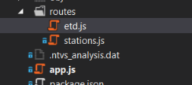


Inside etd.js add the require to unirest and make an exported function called **list**:

```js
    var unirest = require('unirest');

	exports.list = function (req, res) {
    

	}
```

We call this function list because it will return an object collection (of all Bart station estimated times).

Make a call to the Bart JSON api **GET http://bartjson.azurewebsites.net/api/etd.aspx?cmd=etd&orig=all&key=<YOUR_API_KEY>**, check if there is an error, other wise return the json data:

```js
    var unirest = require('unirest');

	/*
	    GET /api/etd
	*/
	exports.list = function (req, res) {
	
    unirest.get("http://bartjson.azurewebsites.net/api/etd.aspx?cmd=etd&orig=all&key=" + process.env.API_KEY, function (apiResponse) {
        
	        if (apiResponse.error) {
	            //there was an error. Indicate to the client what went wrong
	            res.send(500, { message: apiResponse.error });
	            return;
	        }
	
	        res.send(apiResponse.body);
    
    	});

	}
```
Now, lets register our api with the Express by first adding a require to the **etd.js** module in **app.js**:

```js
    var etd = require('./routes/etd.js');
```

And adding the handler as a GET api for the **/api/etd** route:

```js
	app.get('/api/etd', etd.list);
```
Use Advanced Rest Client to validate that the API works correctly:

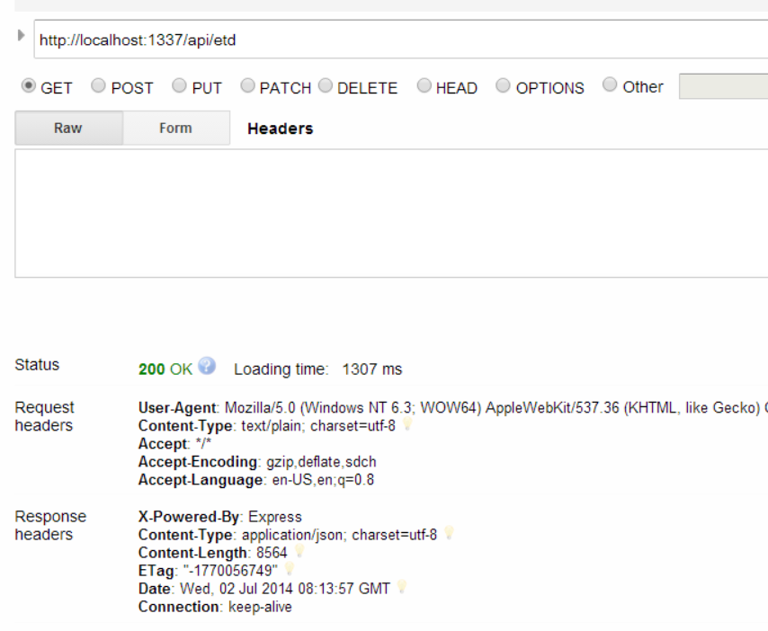

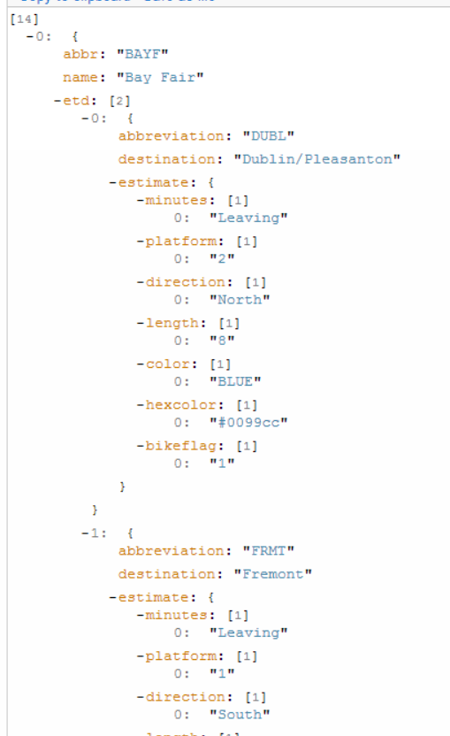


We should also implement an API that will just return a single station, since during rush hour, there can be a lot of trains in the system with lots of estimated arrival data.

This API will be **GET /api/etd/STATION_ABBREVIATION**.

Add a new export **get** in the etd module:

```js
    exports.get = function (req, res) {

    }
```

The only tricky part in this api is to grab the last part of the route to get the station abbreviation code which tells us which station to pass in the **orig** parameter to the Bart API:

```js
	exports.get = function (req, res) {
		//the ':id' part of the route will b req.params.id
	    var station = req.params.id;
	}
```
In the Express [documentation]() request.params.id will contain the ':id' portion of the request route. This id will be the abbrevation for our station (For example Powell St Station is abbreviated PWOL, so a possible route is /api/etd/POWL).

Now that we have the station abbreviation we can do the same thing as the **/api/etd** route and just call the Bart Api with **orig=station**:

```js
	//pass the origin parameter set to the station name
    unirest.get("http://bartjson.azurewebsites.net/api/etd.aspx?cmd=etd&orig=" + station + "&key=" + process.env.API_KEY, function (apiResponse) {
        
        if (apiResponse.error) {
            //there was an error. Indicate to the client what went wrong
            res.send(500, { message: apiResponse.error });
            return;
        }
        
        res.send(apiResponse.body);
    
    });
```
Putting it all together the api code for **/api/etd/STATION_ABBREVIATION**:

```js
    /*
    GET /api/<STATION_ABBREVIATION>
	*/
	exports.get = function (req, res) {
	    //the ':id' part of the route will b req.params.id
	    var station = req.params.id;
	    
	    //pass the origin parameter set to the station name
	    unirest.get("http://bartjson.azurewebsites.net/api/etd.aspx?cmd=etd&orig=" + station + "&key=" + process.env.API_KEY, function (apiResponse) {
	        
	        if (apiResponse.error) {
	            //there was an error. Indicate to the client what went wrong
	            res.send(500, { message: apiResponse.error });
	            return;
	        }
	        
	        res.send(apiResponse.body);
	    
	    });
	
	}
```
Now in **app.js** we have to register this route to the Express app:

```js
	//the ':id' will match any route with '/api/etd/STATION_ABBREVIATION'
	app.get('/api/etd/:id', etd.get);
```
Run the application and test the api with the Union City station by calling ** GET /api/etd/UTCY** with Advanced Rest Client:

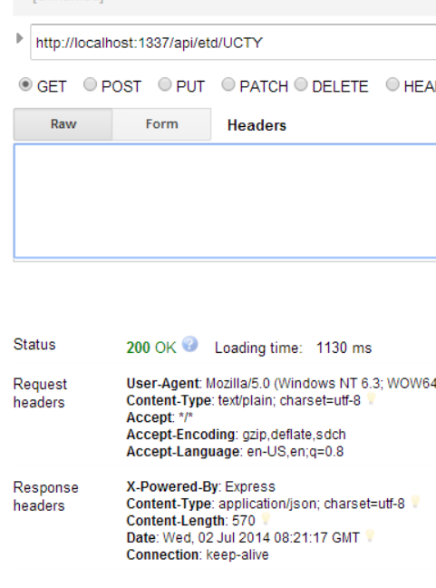

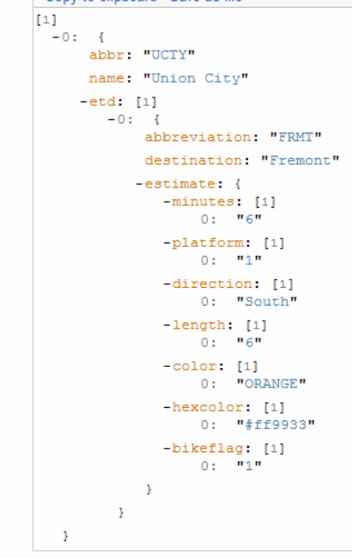

Notice how the API returns only 1 station.

Congratulations! You've implemented everything you need on the backend to power the BartNOW web app with live data!