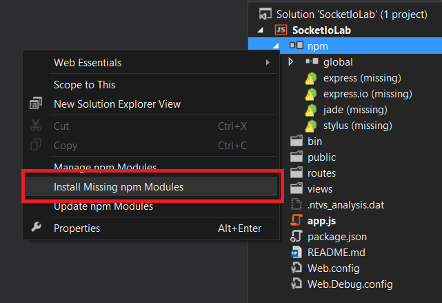
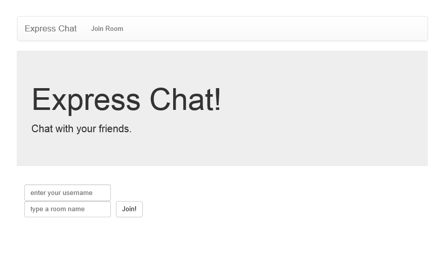
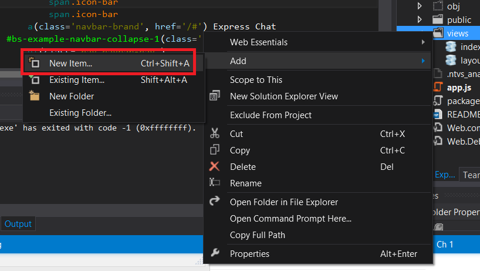
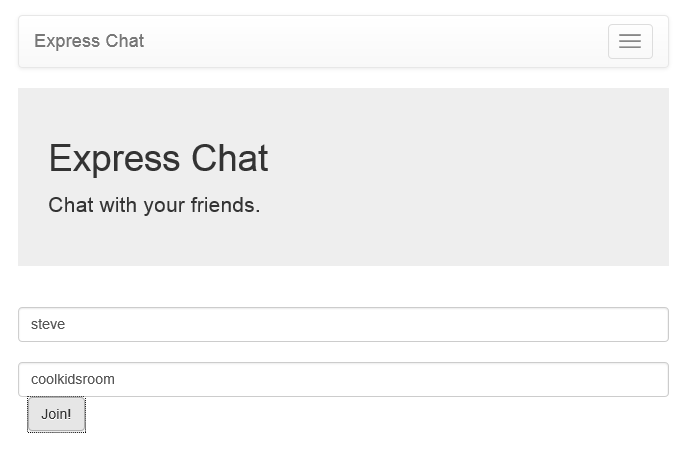
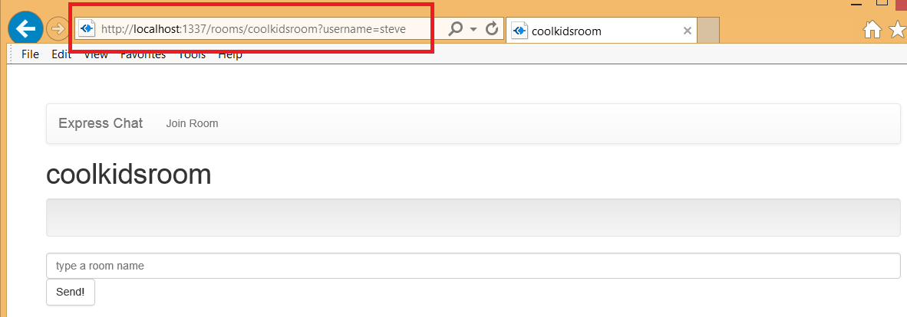
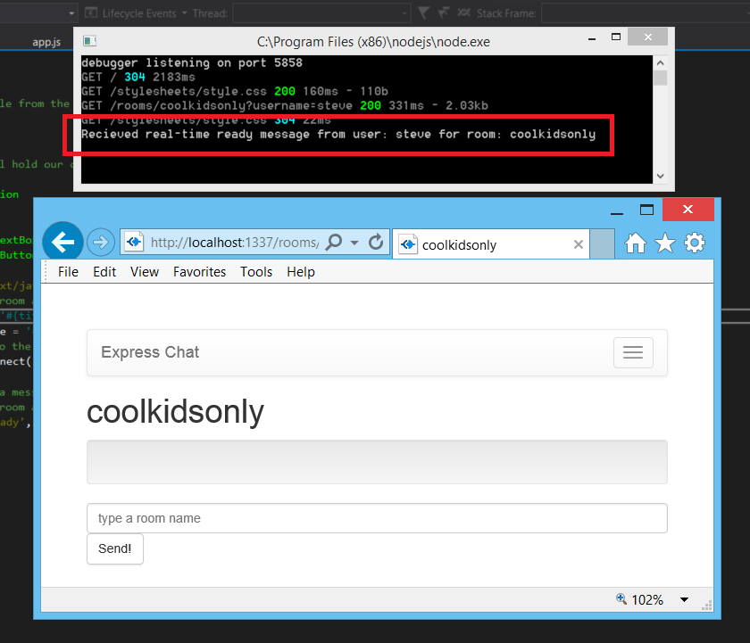
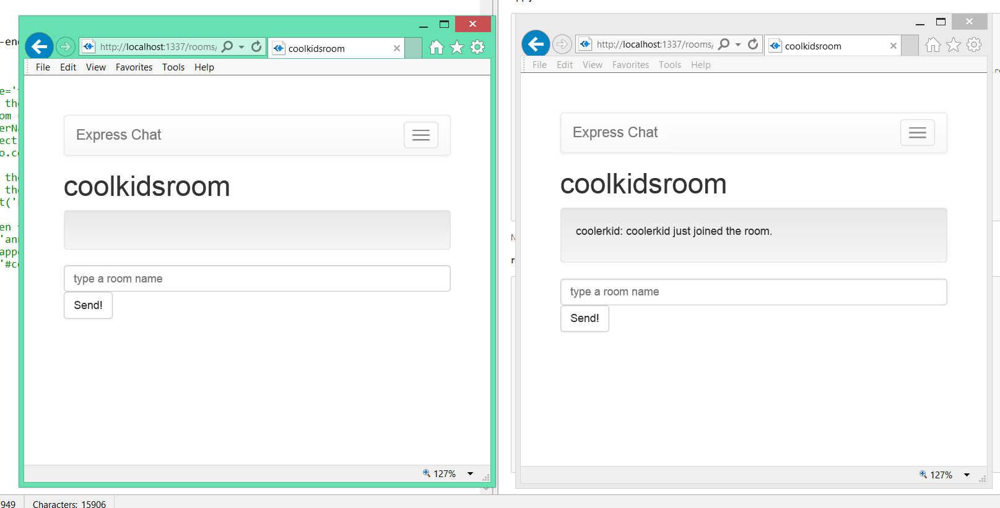
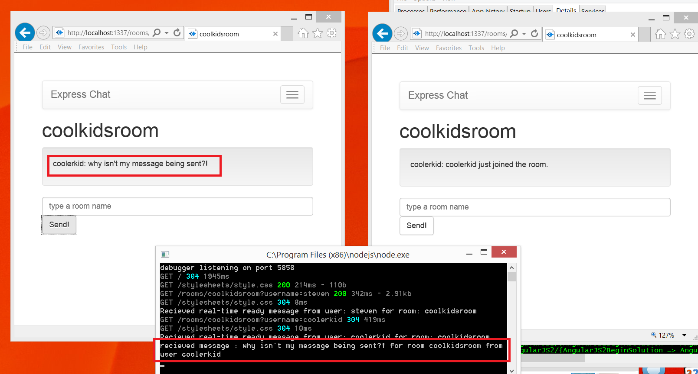
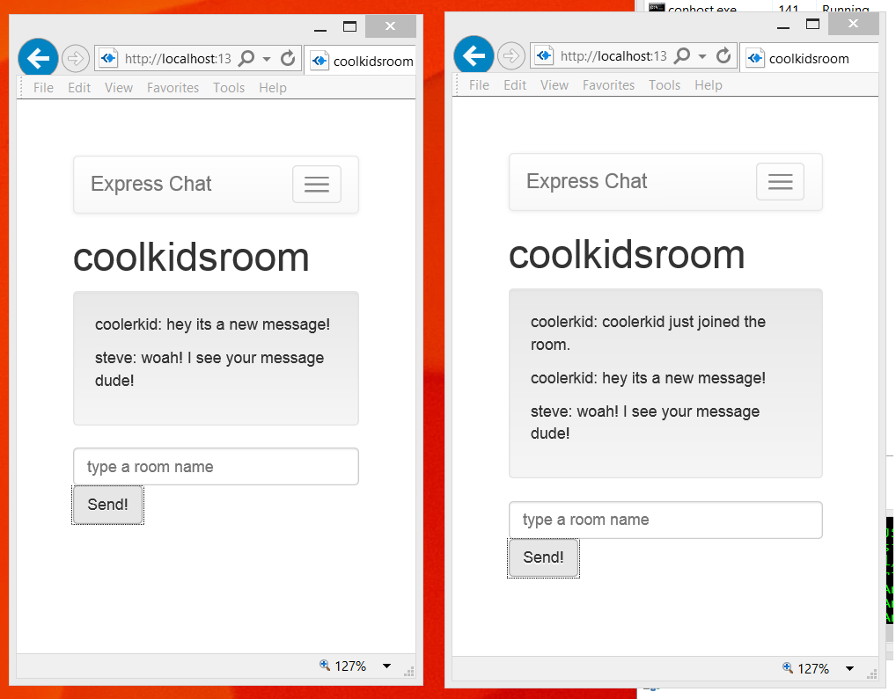

Real-Time Messaging: Creating a simple chat app
=============

## Objectives

At the end of this lab you will know:

1. The difference between Real-time communication vs HTTP communication
2. How to use Express.io and Socket.io javascript library to send and recieve real-time messages
3. Using Express.io with Express to create a website that has real-time communication


## Introduction

[Express.io](https://github.com/techpines/express.io) is a a library for Express web framework that makes it easy to use [socket.io](https://github.com/Automattic/socket.io) a web library that uses [WebSocket](http://en.wikipedia.org/wiki/WebSockets) technology for real-time messaging.

Websockets can be thought of as a consistent connection from the server, to the front-end client (often times a web browser). Consequently, websockets have a **much higher operating cost when compared to just HTTP** because each browser that connects to the server holds a consistent connection to the server.

HTTP however, is a stateless connection and is only 1 request/response transaction at a time. Every browser ends its communciation with the server after it has received the requested data.  On the flip side, HTTP is unable to provide fast real-time messaging due to the fact that the connection opens and closes for each message.

In this lab we'll create a web app **Express Chat** which allows us to join a chat room and chat with our friends.

Getting started

To get started, open the starter Visual Studio solution, [StartProject/SocketIoLab](StartProject/SocketIoLab.sln) in Visual Studio 2013.

Just like previous Express labs, install the missing npm modules because they aren't included in the git repository.




Notice how we now have a new module, **express.io**. This is an express adapter for the socket.io node library. It works as a *superset* of express and socket.io. 

"*Superset?*" what does that mean? It means that you can use express.io the same as express except you also have the functionalities of socket.io.

Now take a look at **app.js**, it has a few subtle differences from our previous express Start project from the [NodeRecipes](../../Tuesday/Session_10_Express1/README.md) lab:

**app.js**

    
    
	/**
	 * Module dependencies.
	 */
	
	var express = require('express.io');
	var routes = require('./routes');
	var user = require('./routes/user');
	var http = require('http');
	var path = require('path');
	
	var app = express();
	//setup socket.io
	app.http().io();
	
	// all environments
	app.set('port', process.env.PORT || 3000);
	app.set('views', path.join(__dirname, 'views'));
	app.set('view engine', 'jade');
	app.use(express.favicon());
	app.use(express.logger('dev'));
	app.use(express.json());
	app.use(express.urlencoded());
	app.use(express.methodOverride());
	app.use(app.router);
	app.use(require('stylus').middleware(path.join(__dirname, 'public')));
	app.use(express.static(path.join(__dirname, 'public')));
	
	// development only
	if ('development' == app.get('env')) {
	  app.use(express.errorHandler());
	}
	
	//BEGIN REAL-TIME ROUTES
	
	//END REAL-TIME ROUTES
	
	//BEGIN REGULAR HTTP ROUTES
	
	//END REGULAR HTTP ROUTES
	
	app.listen(app.get('port'));


Everything is almost the same as before except a couple things. First off the require to express is actually a require to **express.io** module.

    var express = require('express.io');

Remember this is a *superset* of express so you can use everything you normally use. The next thing is this line here:

	app.http().io();

This tells express that we are using Socket.io and that it should set things up for us to use it. One more thing that has changed slightly. Instead of using the **http.createServer** library api, we will just use the **app.listen** api instead.

	app.listen(app.get('port'));

This will start our express server on the port number specified by the app.set('port'... line. This port will be used for both HTTP and Websocket connections.


##Creating the front end client

This lab will use Express jade templates to create the front-end client using [Server-side rendering](http://openmymind.net/2012/5/30/Client-Side-vs-Server-Side-Rendering/). The starter project already has the **index.jade** view created. This view just contains a jumbotron, two input text boxes, a 'join' button and a tiny amount of in-line javascript to navigate to the **rooms** route that we will go to once the button is clicked.

    
    extends layout

	block title
	    .jumbotron
	        h1 Express Chat!
	        p Chat with your friends.
	block content
	    
	    form(class='navbar-form navbar-left' role='search')
	        .form-group
	            input#usernameTextBox(type='text' class='form-control' placeholder='enter your username')
	            br
	            input#roomTextBox(type='text' class='form-control' placeholder='type a room name')
	            button#joinButton(type='button' action='' class='btn btn-default' style='margin-left:10px') Join!
	
	    script(type='text/javascript').
	        
	        $('#joinButton').click(function(evt){
	            //window.location will change the browser address to the right hand of the equal sign.
	            //for example a room name 'coolkids' with user Steve 
	            //will set the broswer to [hostname]/rooms/coolkids?username=Steve
	           window.location = 'rooms/' + $('#roomTextBox').val() + '?username=' + $('#usernameTextBox').val();
	           return;
	        });

The page layout is already created for you and is very similar to the **layout.jade** from the  [NodeRecipes](../../Tuesday/Session_10_Express1/README.md) lab. First it pulls in references to bootstrap and the socket.io client side library. It contains a bootstrap [**navbar**](http://getbootstrap.com/components/#navbar) controller and extendable blocks for **title** and **content** for *extension views*.

    doctype html
	html
	  head
	    title= title
	    link(rel='stylesheet', href='/stylesheets/style.css')
	    meta(name='viewport', content='width=device-width, initial-scale=1.0')
	    script(src='//cdnjs.cloudflare.com/ajax/libs/jquery/2.1.1/jquery.min.js')
	    link(rel='stylesheet', href='//cdnjs.cloudflare.com/ajax/libs/twitter-bootstrap/3.2.0/css/bootstrap-theme.min.css')
	    link(rel='stylesheet', href='//cdnjs.cloudflare.com/ajax/libs/twitter-bootstrap/3.2.0/css/bootstrap.min.css')
	    script(src='//cdnjs.cloudflare.com/ajax/libs/twitter-bootstrap/3.2.0/js/bootstrap.min.js')
	    script(src='//cdnjs.cloudflare.com/ajax/libs/socket.io/0.9.16/socket.io.min.js')
	  body
	      nav(class='navbar navbar-default', role='navigation')
	                .container-fluid
	                    .navbar-header
	                        button(class='navbar-toggle', data-toggle='collapse', data-target='#bs-example-navbar-collapse-1')
	                            span.sronly
	                            span.icon-bar
	                            span.icon-bar
	                            span.icon-bar
	                        a(class='navbar-brand', href='/#') Express Chat
	                    #bs-example-navbar-collapse-1(class='collapse navbar-collapse')
	                        ul(class='nav navbar-nav')
	                            li
	                                a(href='/') Join Room
	      block title
	      block content

### Creating the home page (http) route

However we don't have our default route setup to show this view. To do this we add a route to our **//BEGIN HTTP ROUTES** section of **app.js**. This time, for brevity, we will define the route handler within the file. Although best practice is to break it out to a different file like the previous labs.

```js
	//BEGIN REGULAR HTTP ROUTES

	//render our default home page
	app.get('/', function (req, res) {
	
		res.render('index', { title: 'Express Chat' });
	
	});
```

Run the app and you'll see the **index.jade** home page template loaded in the browser:



### Creating the room view

We need some UI for each chat room. We can use a single template to represent each room created. Add a new view **room.jade**:




Now, each chat room page should have the name of the chat room as a title. So to do this we'll extend the layout view and add a **title** block which will get placed in the title portion of the page layout:

**room.jade**
```jade
    extends layout

	block title
	    //show page title from the title object in underlying model
	    h1 #{title}
```
We will add a paragraph with the html **id** as **conversation** to hold the chat conversation inside a bootstrap [**well**](http://getbootstrap.com/components/#wells) component:

**room.jade**
```jade
	//this well will hold our conversation of the room
    block content
		.well
    	p#conversation
```
We will use the bootstrap **formgroup** class div to house the textbox where we can compose and send messages:

**room.jade**
```jade

	.form-group
        input#chatTextBox(type='text' class='form-control' placeholder='type a room name')
        button#sendButton(type='submit' class='btn btn-default') Send!
```

Putting it all together our room template code is:

```jade
extends layout

block title
	//show page title from the title object in underlying model
    h1 #{title}
block content

    //this well will hold our conversation of the room
    .well
        p#conversation

    .form-group
        input#chatTextBox(type='text' class='form-control' placeholder='type a room name')
        button#sendButton(type='submit' class='btn btn-default') Send!
```

Now all that needs to be done is to create the room route and render the room view:

**app.js**
```js
	app.get('/rooms/:id', function (req, res) {
    
	    //render the room template with the name of the room for the underlying data model
	    res.render('room', { title : req.params.id, username : req.query.username });

	});

```

Now, run your web server. The broswer should go to http://localhost:<port number>. Join a new room and you'll be taken to a chat room with the name you gave it:




Notice how the url for the room name is **/rooms/coolkidsroom?username=steve**. We are using the model id **coolkidsroom** because the route is defined '/rooms/:id' and the using the query parameter **username=steve**. We will  use this query parameter later.



Congratulations! You've created the front-end user interface (UI) to your chat application. We still need to do some more work on the front-end and the back-end to facilitate real-time messages for the chat functionality.

## Creating Express.io Real-time routes

Real-time routes are slightly different in that they talk very quickly and directly to the browser. These routes define the kinds of messages the front-end javascript can instantly send to our server. The communication of the real-time routes is all incoming, that is the data will come from the client to the server, and not the other way around.

Our application will have 2 **realtime routes:**

	-Ready
		-Sent by the client when it request to join or create a room

	-SendMessage
		-Sent by the client when it wants to send an instant message data to the room

In addition to the real-time routes the server will talk back to the front-end through 2 real-time **broadcasts**. Think of a broadcast as a way to send a message to everyone who is in a room:

	-announce
		-Broadcasted by the server to room to announce that a client has joined the room

	-newMessage
		-Broadcasted by the server to room share an instant message with the entire room

### The 'ready' real-time route and 'announce' broadcast

Creating a real-time route is similar to creating an tradition route except that we use **app.io.route** and that our handler does **not** have a **res** parameter, because we do not respond to the client via a real-time route:

```js
	// Setup the ready route, join room and broadcast to room.
	app.io.route('ready', function (req) {
	
		console.log('Recieved real-time ready message from user: ' + req.data.username + ' for room: ' + req.data.room);

	});
```
**req.data** contains the json data that the client sends to us. We will be expecting a  JSON object with **username** and **roomfield** values.

Now in our **room.jade** layout, lets add the in-line javascript that will call this route:

**room.jade**
```jade
	script(type='text/javascript').
		//both the room and username is determined from the jade html template
		var roomName = '#{title}' 
	    var userName = '#{username}'
		//connect to the server using the socket.io front-end js library
	    io = io.connect();
	
		//send the a message to the 'ready' route with the room and the username
		
	    io.emit('ready', {room : roomName, username: userName });


```

Here is what that javascript looks like when it is rendered in the browser:

**(rendered script within HTML script tags in browser)**
```js
<script type="text/javascript">//get the room name from title string in the data model
	var room = 'coolkidsroom';
	var userName = 'steve';
	//connect to the server using the socket.io front-end js libraries
	io = io.connect();
	
	//send the a message to the 'ready' route with the room and the username
	//both the room and username is determined from the jade html template
	io.emit('ready', {room : room, username: userName });
</script>

```
(Note how the #{title} and #{username} data comes from the underlying jade model and is placed directly as javascript string literals.

Start up the web server, and create a new room. Now, when you reach the room view, you will see that your server received the real-time message:



Notice how we didn't have to respond to this message, unlike HTTP where we must respond to every message.

**Broadcasting the announce event back to the front-end client(s)**

One feature of our chat room will be to announce to everyone that someone has entered the room. We can do this by attaching our realtime request **room** using req.io.join and broadcasting to it:

**app.js**
```js
	
//BEGIN REAL-TIME ROUTES
// Setup the ready route, join room and broadcast to room.
app.io.route('ready', function (req) {
	
    console.log('Recieved real-time ready message from user: ' + req.data.username + ' for room: ' + req.data.room);
    //join this request to the specified room
    req.io.join(req.data.room);
    
    //now broadcast an 'announce' event to every client listening to the room
    req.io.room(req.data.room).broadcast('announce', {
        message: req.data.username + ' just joined the room. ',
        username: req.data.username
    });


});
```

Now, the front-end javascript must listen for any announce events:

**room.jade**
```js
    script(type='text/javascript').
        //both the room and username is determined from the jade html template
        var room = '#{title}';
        var userName = '#{username}';
        //connect to the server using the socket.io front-end js libraries
        io = io.connect();

        //send the a message to the 'ready' route with the room and the username
        //both the room and username is determined from the jade html template
        io.emit('ready', {room : room, username: userName });
        
        //listen for any real-time announce events coming from the server
        io.on('announce', function(data){
            //append a new paragraph line to the paragraph with the HTML id conversation
            $('#conversation').append('<p>'+data.username + ': '+ data.message+'</p>');
        });
```

Run the application, navigate to a new room. Open a new browser and navigate to the same room with a different user name. You can see that when you enter the room, the other client is notified by the **announce** event:



**The sendMessage real-time route and newMessage broadcast**

What good is a chat application if we can't send messages back and fourth to each other? To get this part working we will need to implement an additional real-time route **sendMessage** which will recieve a message from a client.

The **newMessage** broadcast will send a message from the server, to the clients (except the client who sent the origginal message the real-time route).

We will first define the 'sendMessage' real-time route:

**app.js**
```js
app.io.route('sendMessage', function (req) {
    
    console.log('recieved message : ' + req.data.message + ' for room ' + req.data.room + ' from user ' + req.data.username);

});
```

The client will use **io.emit** to send this data to the real-time route: (this example uses the [jquery click event](http://api.jquery.com/click/) on the button HTML element with id **sendButton**)

**room.jade**
```js
//use the jquery click event on the HTML button with id sendButton
script(type='text/javascript').
        //both the room and username is determined from the jade html template
        var room = '#{title}';
	    var userName = '#{username}';
        var messageText = $('#chatTextBox').val();
        //connect to the server using the socket.io front-end js libraries
        io = io.connect();

        //send the a message to the 'ready' route with the room and the username
        //both the room and username is determined from the jade html template
        io.emit('ready', {room : room, username: userName });
        
        //listen for any real-time announce events coming from the server
        io.on('announce', function(data){
            //append a new paragraph line to the paragraph with the HTML id conversation
            $('#conversation').append('<p>'+data.username + ': '+ data.message+'</p>');
        });
		
		//this code allows us to execute the passed function everytime the message sendButton is clicked
        $('#sendButton').click(function(evt){
	        //broadcast message to room
            var messagePayload = {message: messageText, room: room, username: userName };
            io.emit('sendMessage', messagePayload);

            //write the message we sent in the text box (because we don't recieve our own messages from the server)
            $('#chatTextBox').val(''); //clears the message text box
            $('#conversation').append('<p>'+messagePayload.username + ': '+ messagePayload.message+'</p>'); ///adds  message to conversation
        });

```

Run the application and open up a second browser window. For each browser go to the same room, with different user names. Attempt to send a message from one client to the other:



Notice how the server recieves the message **'why isn't my message being sent'** from the user **coolerkid**. However this message isn't *broadcasted* from the server to the second client. We can fix this by adding code for the server to respond the the real-time route **sendMessage** with a broadcast called **newMessage**:

**app.js**
```js
app.io.route('sendMessage', function (req) {
    console.log('recieved message : ' + req.data.message + ' for room ' + req.data.room + ' from user ' + req.data.username);
    
    //join this request to the specified room
    req.io.join(req.data.room);
    //now broadcast a 'newMessage' message to every client in this room
    req.io.room(req.data.room).broadcast('newMessage', {
        message: req.data.message,
        username: req.data.username
    })
});
```

Now that the server is broadcasting the message from the sending client, we need to have the clients listen for the **newMessage** event from the server. We can do this by using the socket.io function **io.on**:

**room.jade**
```js
	//listen for any new messages from anybody else in the room
    io.on('newMessage', function(data){
        //append a new paragraph with the rea-time message recieved
        $('#conversation').append('<p>'+data.username + ': '+ data.message+'</p>');
    });
```

Now run the application. Again, open with two browsers, each in the same room with different user names:




Now we can send messages to each other! Congratulations you've created your first real-time web application with Node.js, Express and socket.io.